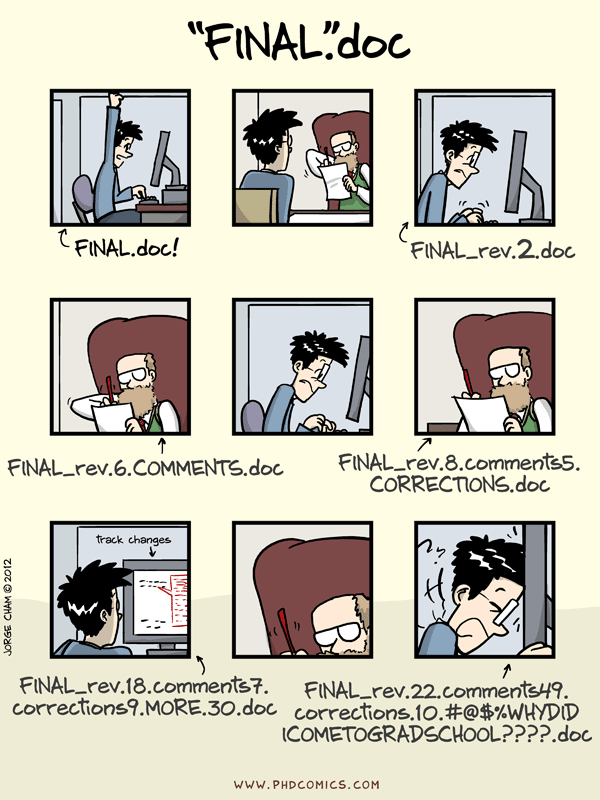

# Syllabus

## Course info
__Instructor__:  
Nicholas Kaukis (Dr. Nick)  
Office: Informatics East 210A (Not Luddy Hall)  
Email: nick@iu.edu 

__Office hours__:  
Me: MWF 2:00 PM - 4:00 PM  
TA: TBD

__Main Webpages__:    
Course: https://STAT-S432SP2019.github.io  
Github: https://github.com/orgs/STAT-S432SP2019  
Slack: https://stat-s432sp2019.slack.com  
Grades: https://canvas.iu.edu

__Lectures__:  
TR 2:30 -- 3:45 PM  

__Textbooks__:  
We will use two books mainly. Both are free online. The first is still in progress and subject to change, 
so you may want to check if any updates are available occasionally.

Required: [_Advanced Data Analysis from an Elementary Point of View_](https://www.stat.cmu.edu/~cshalizi/ADAfaEPoV/)  
Required: [_Introduction to Statistical Learning_](http://www-bcf.usc.edu/~gareth/ISL/)  
Note that both of these textbooks are completely free. In this PDF, click the book title to get to the book webpage.


__Prerequisite__:  
STAT-S 431 or equivalent or permission of the instructor.

## Course objective

This is a course in advanced data analysis. Based on the theory of
linear models covered in S431, this course will focus on applying many
types of data analysis methods to (hopefully) interesting datasets. The focus will
be dealing data and the various methods that can be used.


I expect that the material should be appropriate and interesting to
students coming from either statistics or informatics/computer
science. I will make an effort to provide necessary background so that
lectures are accessible to both populations.

We will put special emphasis on learning to use certain tools common to companies which actually _do_
data science. This includes [Slack](https://stat-s432sp2019.slack.com), [GitHub](https://github.com/orgs/STAT-S432SP2019), [Rstudio](https://www.rstudio.com), and [Rmarkdown](http://rmarkdown.rstudio.com/). As such, we will
require the use of these technologies.

## Lectures

Class time will consist of a
combination of lecture, discussion, questions and answers, and problem
solving. You are strongly encouraged to bring a laptop to class.


## Course communication

This class will use [Slack](https://stat-s432sp2019.slack.com) for class communication. Slack is a Team messaging
app which is frequently adopted by companies and research groups. We will use it for announcements, questions, 
homework communication, etc. You are required to use it. 

Since homework and the project are team-based, you need a way to communicate with your team. Slack is that way. You can
create a special channel for your team. You can direct message individuals. You can message me or the TA. You can post
pictures of cats. The sky is the limit. By using Slack, we will avoid sending lots of email back and forth.

Slack has apps for iPhone or Android, Mac or Windows. Or you can use the web.

If you send me email instead, I will direct you to the proper Slack channel, unless it is a private matter such as your grades.

## Communication rules

- All content-related (non-personal) questions should be asked in [Slack](https://stat-s432sp2019.slack.com). There are various channels in Slack, try to select the most relevant one for your question, or use the general channel if you are unsure.
For personal issues, email or direct message me (\@NickAtIU) or the TA, Ethan.
- Before posting a new question please make sure to check if your question has already been answered. Just search.
- It may be more efficient to answer your question __in-person__ so make good use of office hours.
- I try to reply to messages as soon as I can.  


## Grading

10 In-class exercises (5 points each)  
10 Reading responses (5 points each)  
6 Homeworks (25 points each)  
1 Course project (PC 1/PC 2/PC 3/Presentation 15/35/75/25)  
2 Take-home exams (150 points each)  
Participation (50 points)


In all cases, a fixed number of points may be __earned__ for each
exercise. Points are not necessarily deducted for poor performance in this
class. Points are awarded for excellent performance.


## In-class exercises

* We will regularly have short programming or theoretical exercises during class time.
* At the end of class, you will push your results to Github for grading
* Complete submissions will receive full credit.
* Partial submissions will receive 2 points.
* There will be at least 10 of these during the semester.
* Any submissions you make in excess of 10 will be extra credit.

## Reading responses

* Each chapter will have a short coding exercise which you should submit before we cover the chapter. 
* I will post the exercise on Github, you clone it and upload your changes. 
* These will generally be due before class begins on __Tuesday__ each week. 
* Complete submissions will receive full credit. 
* Partial submissions will receive 2 points. 
* There will be at least 10 of these during the semester. 
* Any submissions you make in excess of 10 will be extra credit.

## Homeworks

* Homework assignments will be completed in groups which I assign. 
* These groups will rotate for each assignment.
* Each team will have their own private repository. 
* All assignments will be submitted on Github. 
* Homework grades
will be awarded based on complete and accurate analyses according to the rubric provided with each assignment.
* Grades will be adjusted up or down based on participation according to the Github commit messages. 
* You are
expected to consult only with me, the TA, or your assigned group, with the exception of conversations which occur
during class meetings or office hours in the presence of me or the TA. 


## Project

* You will be required to complete a team project (2-4 people). 
* You may choose this group. 
* The goal is to analyze and communicate the analysis of a dataset in depth using anything that you have learned. 
* The project will have three checkpoints: 
    1. PC 1 will be due __Thursday, January 31__ (It's just one page, don't freak out), 
    2. PC 2 is due __Thursday, March 7__, 
    3. PC 3 is due on __Monday, April 29__. 
* All are to be uploaded to your repo by 11:59pm on those dates. 
* An outline of project requirements will be posted on [Github](https://github.com/orgs/STAT-S432SP2019)
* The entire class will give brief presentations during the last week of classes (04/23/2019 \& 04/25/2019). 

## Exams

* There will be two take home exams. 
* Both will be completed _entirely_ individually. 
* The midterm will be made available on __Friday, Febuary 22__ for submission by __Friday, March 1__.
* The second exam will be available __Friday, April 12__ for submission by __Friday, April 19__. 
* In both cases, the exam file will be downloaded from your personal repo at 11:59pm on the due date. 
* Late submissions will not be accepted.

> If either of these dates pose some type of problem, you please notify by the end of January. Otherwise, no alternatives will be considered without medical documentation.

## Solutions

* Some of the problems that are assigned are similar or identical to those assigned in previous years
by me or other instructors for this or other courses. 
* Using proofs or
code from anywhere other than the textbooks (with attribution), this
year's course notes (with attribution), or the course website is not
only considered cheating 
(as described above), it is easily detectable cheating. 
* Such behavior is strictly forbidden.

## Cheating

* Cheating, in my experience, occurs because students don't understand the material, so the result is usually a failing grade even before I impose any penalty and report the incident to the Dean's office. 
* It is way easier to catch cheating than you probably think, and it does not help you in anyway. 
* Do your own work, and use the TA and me as resources. 
* If you are struggling, we are here to help.  
* If I suspect cheating, your case will be forwarded to the Dean's office. No questions asked.  

##Acknowledgement  
I want to give my thanks to Professor Dan McDonald for providing such a rich set of resources for establishing this course. I hope to add my own flair to the course content as the course progresses.

\newpage
# Github

## Acknowledgements

* Much of this lecture is borrowed/stolen from Colin Rundel, Karl Broman, and Dan McDonald


## Why version control?
This is seriously how my dissertation went...  
<p align=center>
  
__Source__: http://phdcomics.com/comics/archive.php?comicid=1531
</p>

This process was quite painful and I wish I knew how to use GitHub at the the time.


* A "Simple"" formal system for tracking all changes to a project is _extremely_ useful
* You can have a time machine for your projects
    + Track blame and/or praise
    + Remove the fear of breaking things
* Learning curve is steep, but when you need it, you REALLY need it

> "Your closest collaborator is you six months ago, but you don't reply to emails.""
> -- _Paul Wilson_

## Why Git

* You could use something like Box or Dropbox, but these are poor version controls
* Git is much more appropriate
* It works with large groups
* It's very fast
* It's much better at fixing mistakes, i.e., reverting to previous versions is easier.
* Tech companies use it (so it's in your interest to have some experience)

> Getting used to this will be difficult. I am going through this pain with you.

## Set up

* Open Rstudio
* Go to the "Tools" menu and select "Shell"
* Type 

```
git --version
```

* If it's there, you're done, otherwise... Goto [thttp://happygitwithr.com/index.html](http://happygitwithr.com/index.html)


## Initial configuration

* Now tell it who your are:

```
$ git config --global user.name "Nick Kaukis"
$ git config --global user.email "nick@iu.edu"
$ git config --global core.editor nano
```

* `nano` is a light-weight text editor. You probably won't ever use it, but it's good to tell
git to use nano. If for some reason git asks you questions about doing things, just remember

> Ctrl + X is quit

(it says this at the bottom of the window)

* This is all that we will do with git in the terminal
* Rstudio has git built in, and so we'll use it through there mostly
* Using the terminal gives access to more complicated issues, which hopefully we won't have to deal with.

## Github

* This is a commercial site that interacts with Git (GitLab and Bitbucket do as well)
* You need a free account http://www.github.com/
* Git tracks changes to your files in both places
* Your files live in __repositories__ (repos in the lingo)
* You and others share access to repos

## When you want to work on a file

* You __clone__ or __pull__ the repo onto your local machine
* Make all your changes
* You __commit__ your changes with a message, e.g.: "I fixed the horrible bug"
* You __push__ your changes back to the repo

## The hard way 

* There are many ways to connect with Git and make changes to repos.
* Besides RStuio, I use [GitKraken](http://www.gitkraken.com/), but see the reading assignment below
* If stuff gets messed up later, we can clean it up with the GUI
* It's a little easier than in Rstudio to fix things

## The rest

* Most of the time, we'll just use Rstudio
* You clone a repo using Rstudio, make your changes, and push using Rstudio

## Slack

* We will use another service called [Slack](https://stat-s432sp2019.slack.com) for communication
* It is also free
* It is also common in industry
* It's just a way to send me, the TA, or your classmates messages
* This replaces the discussion board, announcements, etc on Canvas
* This way, you can talk to your team, you can talk to me, you can ask the class questions
* There are Android and iOS apps
* I will check Slack frequently. Expect answers to any questions within the day they are asked.
(Unless you ask them at like 11:59 PM.)

## In class assignment 1

* Go to https://github.com/STAT-S432SP2019/classroster
* By noon tomorrow, complete steps 1 and 2
* Read http://happygitwithr.com/index.html
* Bring your laptop on Thursday (see me if you need an alternate solution)