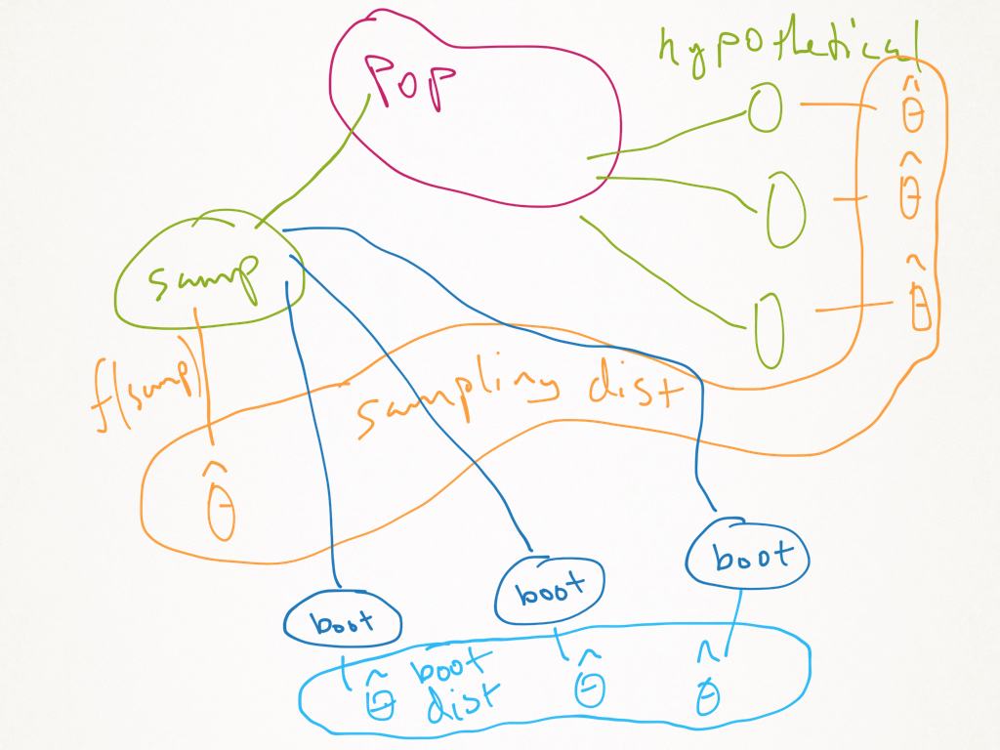

\newcommand{\Expect}[1]{\mathbb{E}\left[ #1 \right]}
\newcommand{\Var}[1]{\mathbb{V}\left[ #1 \right]}
\newcommand{\Cov}[2]{\mathrm{Cov}\left[#1,\ #2\right]}
\newcommand{\given}{\ \vert\ }
\newcommand{\E}{\mathbb{E}}
\renewcommand{\P}{\mathbb{P}}
\newcommand{\R}{\mathbb{R}}

## Midterm Exam

```{r setup, echo=FALSE, message=FALSE, results='hide'}
library(tidyverse)
theme_set(theme_minimal(base_family="serif"))
green = '#00AF64'
blue = '#0B61A4'
red = '#FF4900'
orange = '#FF9200'
```

1. You must compile the `.Rmd` to `.pdf`

2. No code visible in the `pdf`. It is a report.
  
3. If you put plots or tables in, you must talk about them. 
  
  > Rule of thumb: if you don't have anything good to say about a number, don't give the number (or plot) at all.
  
4. __MOST IMPORTANT__ you must explain your results. Simply providing them is not likely to get you full credit (if any). Numbers without context is meaningless.


## Project progress report

* Due __7 March at 11:59 pm__ 

* Your report should have 3 components:  

    1. A list of teammate names and an explanation of what is interesting to you about this data.
    2. A short introductory paragraph introducing the data and describing some potential questions you might investigate.
    3. A lengthy exploratory data analysis.
    
* The third part is a big deal.

* You need to provide evidence that you have explored the data carefully and meaningfully.

* Code must be integrated.


# Simulation

## What is simulation?

Simulations are often used to assess the performance of an estimator, model, hypothesis test, confidence intervlas, etc...

The basic procedure that gets used is something like this.

1. Produce a randomly generated dataset from a distribution/probability model.
2. Apply the statistcal procedure to the data.
3. Repeat 1 and 2 a "large" number of times.
3. Repeat 1 - 3, for different sample sizes, parameters, distributions, or probability models.
4. Summarise the results.
5. Compare results to previous methods, or theoretical values, or asymptotics.
6. Report the findings.

## Example

In introductory statistics, we are given the formula $\overline{X} \pm t_{df,\alpha/2}\frac{s}{\sqrt{n}}$ and we are told it is a "Confidence interval" 

_"We are [whatever]% confident that the true mean is within [confidence interval]"_

The confidence level is based on __asympotics__ unless data come from an exactly normal distribution.

Then we say to not worry about the data if we have a "large" sample.

```{r conf.int.demo}
# CI Example
m = 10000 # Number of samples
n = 40 # sample size
a = .05 # Alpha for CI

# Generate data
data <- matrix(rlnorm(m*n), nrow = n, ncol = m)

# Sample Statistics
means <- colMeans(data)
sds <- apply(data, 2, sd)

# CI Bounds
lower <- means - qt(1-a/2, n -1)*sds/sqrt(n)
upper <- means + qt(1-a/2, n -1)*sds/sqrt(n)

mu = exp(1/2) # True mean 

# Empircal Confidence
sum(lower < mu & upper > mu)/m
```

## Why Simulation?

Up until now, when we do linear models, we used $t$-statistics, $p$-values, CIs, etc. All of which have some explicit formula and some explicit probability distribution associated with them.

These things are based on the sampling distribution of the estimators ($\hat{\beta}$) if the model is true and we don't do any model selection.

What if we do model selection, use Kernels, think the model is wrong?

None of those formulas work. And analogous formulas can be __impossible__ (or painfully annoying) to derive.

One of the ways we will go over to bypass this last issue is through __resampling__

\newpage

## Some Resampling Basics

Resampling is taking your original dataset and drawing a random sample. Let's look at the baseline function for doing that, `sample(x, size)` 

```{r}
set.seed(999) # We use seeds so that others can replicate our results.
sample(1:10, replace=TRUE, prob=1:10)# prob automaticall normalizes
sample(letters[1:10], replace=TRUE, prob=1:10)
sample(letters[1:10], replace=TRUE)
sample(letters[1:10])
sample.int(10)
```

Another functions that is useful for simulation is the `replicate(n, expr)` function.
```{r eval = F}
x = runif(0,1)
beta0 = 3; beta1 = 2
output <- replicate(1000, rnorm(length(x), beta0 + beta1 * x, sigma))

# Functionally the same as this, but this is slower
output <- matrix(0, nrow = 1000, ncol = length(x))
for (i in 1:1000) {
output[i, ] <- rnorm(length(x), beta0 + beta1 * x, sigma)
}

```

\newpage
# Simulating and Resampling Example: The Linear Model

First, lets generate some ideal data if we were going to use a linear model.

```{r, fig.align='center', fig.height=4.5}
set.seed(111)
n = 100; x = runif(n)
df = data.frame(x=x, y=3+2*x+rnorm(n))
ggplot(df, aes(x,y)) + geom_point(color=blue,shape=15) +
  geom_smooth(method = 'lm', se = F)
```

\newpage
## A sample (with replacement), and a new draw from the same distribution

```{r, fig.align='center', fig.height=4.5}
resample <- function(df) {
  stopifnot(is.data.frame(df) | is.matrix(df)) # Data verification
  df[sample(1:nrow(df), replace = TRUE),]
}
# Resample
df2 = resample(df)

#New from same model
xn = runif(n)
df3 = data.frame(x=xn, y=3+2*xn+rnorm(n))

# Combine data into 'long' format for ggplot
df = rbind(df,df2,df3)

#Give data groups
df$grp = rep(c('original','resample','new draw'), each=n)

p <- ggplot(df, aes(x,y,color=grp)) + geom_point(aes(shape=grp)) +
  scale_color_manual(values=c(red,blue,orange)) +
  theme(legend.title = element_blank(),legend.position = 'bottom')

p
```
\newpage
## Add some lines

```{r, fig.align='center', fig.height=4.5}
# Plot some lines over that same plot. Linear regression is performed on each group

p + geom_smooth(method='lm', se = FALSE) # Suppress the  
```

\newpage

# Using resampling to check modeling assumptions

Let's create a model where there is obvious issues with the variance assumption.


```{r, fig.align='center', fig.height=4.5}
x = runif(n) - 0.5; y = 3+2*x + rnorm(n)*x^2

dfHetero = data.frame(x=x, y=y)

ggplot(dfHetero, aes(x,y)) + geom_point(color=blue,shape=17) +
  geom_smooth(method='lm', se=FALSE,color=blue) + 
  geom_abline(intercept = 3, slope=2, color=green)
```

\newpage
## Checking Homoskedasticity

Think about the assumption that the variance of the residuals is constant:

> Does it matter if I randomly pair residuals and $x_i$'s?

```{r, fig.align='center', fig.height=5}
heteromod = lm(y~x,data=dfHetero)
dfHetero$resids = residuals(heteromod)
dfHetero$resample = sample(residuals(heteromod), replace = TRUE)
dfHetero %>% gather(key='type', value='resids',-c(y,x)) %>% 
  ggplot(aes(x,resids,color=type,shape=type)) + geom_point() + 
  scale_color_manual(values=c(red,blue)) +
  theme(legend.title = element_blank(),legend.position = 'bottom') +
  geom_hline(yintercept=0, color=blue)
```

\newpage

## Checking Residuals Independence: Correlated errors

```{r, fig.align='center', fig.height=4.5}
set.seed(222)
x = runif(n)-0.5

# Time series  (residuals have a correlation)
y = 3+2*x + c(arima.sim(list(ar=.8), n, rand.gen = function(n) 0.1* rt(n, df=5)))

dfTS = data.frame(x=x, y=y)

ggplot(dfTS, aes(x,y)) + geom_point(color=blue) + 
  geom_smooth(method='lm',se=FALSE, color=red) +
  geom_abline(intercept = 3, slope = 2, color=blue)
```
\newpage
## Assuming the Residuals Are Independent

* The red and blue points should have the same distribution...

```{r, fig.align='center', fig.height=5}
tsMod = lm(y~x, data=dfTS)
dfTS$resids = residuals(tsMod)
dfTS$resample = sample(residuals(tsMod), replace = TRUE)
dfTS %>% gather(key='type', value='resids',-c(y,x)) %>% 
  ggplot(aes(x,resids,color=type,shape=type)) + geom_point() + 
  scale_color_manual(values=c(red,blue)) +
  theme(legend.title = element_blank(),legend.position = 'bottom') +
  geom_hline(yintercept=0, color=blue)
```

\newpage
## Check the Lag, $e_{i-1}$ vs $e_i$ 

```{r, fig.align='center', fig.height=5}
# The correlation is between a residual and its next value
lag.resids = with(dfTS, data.frame(lag.resids = resids[-n], resids = resids[-1]))

#Resample residuals, this shouldn't matter if they are independent
lag.resids$resample = sample(lag.resids$resids, replace = TRUE)

# Make a plot of lag versus residuals
lag.resids %>% gather(key='type', value='resids',-lag.resids) %>% 
  ggplot(aes(lag.resids,resids,color=type,shape=type)) + geom_point() + 
  scale_color_manual(values=c(red,blue)) +
  theme(legend.title = element_blank(),legend.position = 'bottom') +
  geom_smooth(method='lm', se = F)
```

\newpage

<!--
## What's the deal with this Bootstrap?

<center></center>
-->

# Bootstrapping

Boot strapping takes this idea of a resampling a bit further.

The idea is to recreate the sampling distribution of an estimator. How?

1. Resample data with replacement.
2. Calculate estimate on resampled data.
3. Repeat this B times.

Say `B = 1000`, you now have 1000 different estimates. You now have an estimated sampling distribution.


## Why Bootstrap?

Suppose I want to estimate something and get a CI.

But I don't know how to calculate the CI.

  * we may not have a formula.
  * There is a formula, but it is based on bad assumptions
  * There is a formula, but is is based on asymptotics and we have a small sample.
  * The formula is just plain ridiculous.

Then what? We try bootstrapping.

## The Principle for Bootstrap CIs

First, we will consider the idea for the sample mean.

The basic idea is we will try to replicate the quantity:
\[\delta =  \overline{x} - \mu\]

To replicate this, we take many bootstrap samples and estimate the mean from each sample: $\overline{x}^*_1, \overline{x}^*_2, \dots, \overline{x}^*_B$

Then we calculate:
\[\delta^*_i = \overline{x}^*_i - \overline{x}\]

To get our $(1-\alpha)100\%$ CI, we find the the quantiles of the differences: $\delta^*_{\alpha/2}$ and $\delta^*_{1 - \alpha/2}$, then our CI is:

\[\left(\overline{x} - \delta^*_{1-\alpha/2}, \overline{x} - \delta^*_{\alpha/2}\right)\]

\newpage

## Example: Easy! The Mean (The bad example from the beginning)
```{r, fig.align='center', fig.height=4.5}
n=40
set.seed(999)
x = rlnorm(n)
mean = mean(x)
B = 1000
alpha = 0.05
bootMean <- function(x) mean(sample(x, replace=TRUE))
bootDist = replicate(B, bootMean(x))
bootCI = 2* mean - quantile(bootDist, probs = c(1-alpha/2, alpha/2))
ggplot(data.frame(bootDist), aes(bootDist)) + geom_density(color=blue) +
  geom_vline(xintercept = bootCI, col=blue, linetype=2) + 
  geom_vline(xintercept = mean, col=blue) + 
  geom_vline(xintercept = exp(1/2), col=red) # truth

bootCI
```

\newpage

## Example: $\chi^2$ Distribution
 Let $X_i\sim \chi_4^2$.

We know if we estimate the mean with $\bar{X}$, then by the CLT (if $n$ is big), 
\[
\frac{\sqrt{n}(\bar{X}-\Expect{X})}{s} \approx N(0, 1).
\]

This gives me a 95% confidence interval:
\[
\bar{X} \pm t_{\alpha/2}*s/\sqrt{n}
\]

If we want to estimate the median. The formula
is a bit messier, but it technically exists.

```{r, fig.align='center', fig.height=4.5}
ggplot(data.frame(x=c(0,12)), aes(x)) + 
  stat_function(fun=function(x) dchisq(x, df=4), color=blue) +
  geom_vline(xintercept = 4, color=blue) + # mean
  geom_vline(xintercept = qchisq(.5,4), color=red) # median
```
\newpage
## Bootstrapping the Median

The process is not so different for the median.

```{r, fig.align='center', fig.height=4.5}
n=50
set.seed(667)
x = rchisq(n, 4)
med = median(x)
B = 100
alpha = 0.05
bootMed <- function(x) median(sample(x, replace=TRUE))
bootDist = replicate(B, bootMed(x))
bootCI = 2* med - quantile(bootDist, probs = c(1-alpha/2, alpha/2))
ggplot(data.frame(bootDist), aes(bootDist)) + geom_density(color=blue) +
  geom_vline(xintercept = bootCI, col=blue, linetype=2) + 
  geom_vline(xintercept = med, col=blue) + 
  geom_vline(xintercept = qchisq(.5, 4), col=red) # truth
```
\newpage

## An alternative

In that bootstrap, I didn't use any information about the data-generating process.

> What if I told you that the data came from a $\chi^2$, but I didn't tell you the degrees of freedom?

You could try a "parametric" bootstrap:

```{r, fig.align='center', fig.height=4.5}
xbar = mean(x) # What is the mean of a Chi-Squared Distribution?
s = sd(x)
ParaBootSamp <- function(B, xbar, s){
  means = rnorm(B, mean=xbar, sd=s/sqrt(n)) # add some noise to the mean.
  meds = qchisq(.5, means)
  return(meds)
}
ParaBootDist = ParaBootSamp(B, xbar, s)
ParaBootCI = 2* med - quantile(ParaBootDist, probs = c(1-alpha/2, alpha/2))
ggplot(data.frame(bootDist), aes(ParaBootDist)) + geom_density(color=blue) +
  geom_vline(xintercept = ParaBootCI, col=blue, linetype=2) + 
  geom_vline(xintercept = med, col=blue) + 
  geom_vline(xintercept = qchisq(.5, 4), col=red) # truth
```

\newpage
## Comparing the Methods

Let's compare these intervals

* The nonparametric bootstrap (first one) had a width of
```{r}
bootCI[2] - bootCI[1]
```

* The parametric bootstrap (second one) had a width of
```{r}
ParaBootCI[2] - ParaBootCI[1]
```

Using theory, we could find the exact CI. In this case, it has a width of 1.76.


<!--
## Bootstrap diagram

<center></center>

## Bootstrap intuition

<center></center>
-->
## Bootstrap error sources

Of course, there are some issues with bootstrapping!

1. Simulation error: using only $B$ samples to estimate a distribution $F$ with an empirical estimate $\hat{F}$.

2. Statistical error: our data depended on a sample from the population. We don't have the whole population so we make an error by using a sample (Note: this part is what __always__ happens with data, and what the science of statistics analyzes.)

3. Specification error: If we use the model based bootstrap, and our model is wrong, then we think we are badly overconfident in our assessment of error. 

## Recap

There are essentially 2 types of bootstrap
    1. Parametric
    2. Nonparametric
    
If you __really__ believe your model, use the first

Otherwise, you should use the second by default.

> Both are valid

\newpage
## Linear Models Example And Book Code

```{r, echo=FALSE}
library(MASS)
fatcats = cats
fatcats$Hwt = fitted(lm(Hwt~Bwt, data=cats)) + rt(nrow(fatcats), 3)
```

```{r, fig.width=8, fig.height=6, fig.align='center', results='hide', warning=FALSE}
library(MASS)
ggplot(fatcats, aes(Bwt, Hwt)) + geom_point(color=blue)
```

\newpage
## Linear Model Summary

```{r}
## Running the model on the original data
cats.lm = lm(Hwt ~ 0+Bwt,data=fatcats)
summary(cats.lm)
confint(cats.lm)
```
\newpage
## CIs Use Normality of the Residuals

Can we rely on the confidence interval estimate?

```{r, fig.align='center'}
qqnorm(residuals(cats.lm))
qqline(residuals(cats.lm))
```
\newpage
## Bootstrapping Functions from Shalizi

```{r fns-from-chapter}
resample <- function(x) {
    sample(x, replace = TRUE)
}
resample.data.frame <- function(data) {
    sample.rows <- resample(1:nrow(data))
    return(data[sample.rows, ])
}
rboot <- function(statistic, simulator, B) {
    tboots <- replicate(B, statistic(simulator()))
    if (is.null(dim(tboots))) {
        tboots <- array(tboots, dim = c(1, B))
    }
    return(tboots)
}
bootstrap <- function(tboots, summarizer, ...) {
    summaries <- apply(tboots, 1, summarizer, ...)
    return(t(summaries))
}
equitails <- function(x, alpha) {
    lower <- quantile(x, alpha/2)
    upper <- quantile(x, 1 - alpha/2)
    return(c(lower, upper))
}
bootstrap.ci <- function(statistic = NULL, simulator = NULL, tboots = NULL,
    B = if (!is.null(tboots)) {
        ncol(tboots)
    }, t.hat, level) {
    if (is.null(tboots)) {
        stopifnot(!is.null(statistic))
        stopifnot(!is.null(simulator))
        stopifnot(!is.null(B))
        tboots <- rboot(statistic, simulator, B)
    }
    alpha <- 1 - level
    intervals <- bootstrap(tboots, summarizer = equitails, alpha = alpha)
    upper <- t.hat + (t.hat - intervals[, 1])
    lower <- t.hat + (t.hat - intervals[, 2])
    CIs <- cbind(lower = lower, upper = upper)
    return(CIs)
}
```

\newpage
## Model

```{r fcns-to-create}
## Simulator
resamp.resids.cats <- function(){
  resids = residuals(cats.lm)
  newResids = sample(resids, replace=TRUE) 
    # resample the residuals from the original model
  newCats = data.frame(Bwt = fatcats$Bwt, 
    Hwt=fitted(cats.lm) + newResids) # create a new dataframe 
                                     # with the original x's but new y's
  return(newCats)
}
## Estimator
fitCats <- function(newCats) coef(lm(Hwt~0+Bwt, data=newCats)) # get the coef from OLS
fitCats(fatcats) # test the above on original data, should give same coef
```


## Model-based bootstrap

```{r, cache=TRUE, autodep=TRUE}
cisPara = bootstrap.ci(statistic = fitCats,
                       simulator = resamp.resids.cats,
                       B = 1000, t.hat = fitCats(fatcats),
                       level = 0.95)
```

## Nonparametric bootstrap

```{r,cache=TRUE, autodep=TRUE}
resamp.cats <- function() resample.data.frame(fatcats)
cisNonPara = bootstrap.ci(statistic = fitCats,
                          simulator = resamp.cats,
                          B = 1000, t.hat = fitCats(fatcats),
                          level = 0.95)
  # use the prev func to 
  # bootstrap on resampled data  
cisPara
cisNonPara
```
\newpage
## Bootstrapping with nonparametric regression

This can be much slower depending on the method applied.

* We use CV to choose the bandwidth which can be computationally slow.

* So we have to repeat that step in the bootstrapping.

The process would then be:

    1. Input data
    1. Use CV to choose a smoothing parameter
    2. Use the chosen parameter to estimate the smooth function
    3. Resample the data
    4. Using this new data, repeat 2 and 3