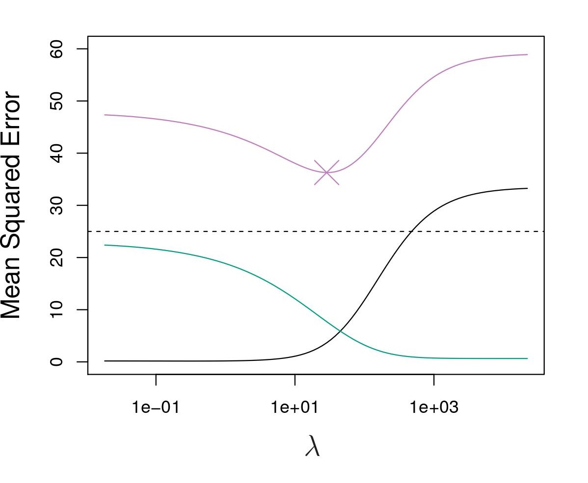
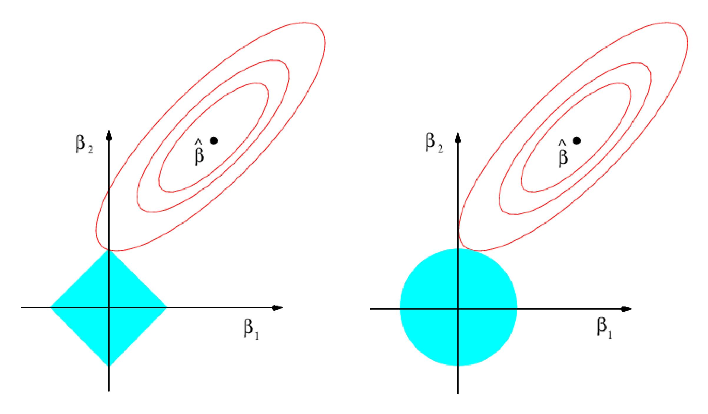

\newcommand{\Expect}[1]{\mathbb{E}\left[ #1 \right]}
\newcommand{\Var}[1]{\mathbb{V}\left[ #1 \right]}
\newcommand{\Cov}[2]{\mathrm{Cov}\left[#1,\ #2\right]}
\newcommand{\given}{\ \vert\ }
\newcommand{\E}{\mathbb{E}}
\renewcommand{\P}{\mathbb{P}}
\newcommand{\R}{\mathbb{R}}
\newcommand{\tr}[1]{\mbox{tr}(#1)}
\newcommand{\brt}{\widehat{\beta}_{r,t}}
\newcommand{\brl}{\widehat{\beta}_{r,\lambda}}
\newcommand{\bls}{\widehat{\beta}_{ls}}
\newcommand{\blt}{\widehat{\beta}_{l,t}}
\newcommand{\bll}{\widehat{\beta}_{l,\lambda}}

\newcommand{\argmin}[1]{\underset{#1}{\textrm{argmin}}}

\renewcommand{\vec}[1]{\underline{#1}}
\newcommand{\vX}{\vec{X}}
\newcommand{\X}{\vX}
\newcommand{\vx}{\vec{x}}
\newcommand{\vY}{\vec{Y}}
\newcommand{\vy}{\vec{y}}
\newcommand{\vbeta}{\vec{\beta}}
\newcommand{\bhat}{\widehat{\beta}}
\newcommand{\vbhat}{\vec{\widehat{\beta}}}
\newcommand{\sumin}{\sum_{i=1}^n}
\newcommand{\sumjp}{\sum_{j=1}^p}


```{r setup, echo=FALSE,results='hide',include=FALSE}
# Need the knitr package to set chunk options
library(knitr)
# Set knitr options for knitting code into the report:
# - Don't print out code (echo)
# - Save results so that code blocks aren't re-run unless code changes (cache),
# _or_ a relevant earlier code block changed (autodep), but don't re-run if the
# only thing that changed was the comments (cache.comments)
# - Don't clutter R output with messages or warnings (message, warning)
  # This _will_ leave error messages showing up in the knitted report
opts_chunk$set(message=FALSE, warning=FALSE, fig.align='center',fig.width=8,
               fig.height=4,cache=TRUE,autodep=TRUE, global.par=TRUE)
par(las=1, bty='n', pch=19, ann=FALSE)
library(tidyverse)
library(gridExtra)
library(MASS)
#theme_set(theme_minimal(base_family="Times"))
green = '#00AF64'
blue = '#0B61A4'
red = '#FF4900'
orange = '#FF9200'
```

## Model Selection

Suppose we are trying to predict $Y$ using $p$ predictors (including an intercept): $\vX^\top =  (1, X_1, X_2, \dots, X_p)$.

\[
Y = \vX^\top \vbeta + \epsilon = \beta_0 + \sum_{j=1}^n\beta_j X_j + \epsilon
\]

Some of the predictors may be related to $Y$, and others may not. There are three main methods for model selection.

1. Subset selection (we briefly talked about this before, we'll go into more detail today)
2. Regularization
3. Shrinkage

These are all based off of modifying the minimization problem at the core of __least squares__ regression.

  \[
  \vbhat = \argmin{\vbeta} \sum_{i=1}^n\left(y_i - \vx_i \vbeta  \right)^2 =\sumin (y_i-\beta_0 - \sum_{j=1}^p \beta_j x_{ij})^2 = SSE
  \]

## Some Model Selection Criterion

In past applications, especially from academic/research settings, various methods are used for selecting models. They are based on examining a "Criterion" calculated using the estimated model.

  * $R^2$ or its adjusted form: a "measure of variability accounted for by our predictors" and its not good.
  * Other more complex ones:
    - $C_p = \frac{1}{n}(SSE + 2p \widehat{\sigma}^2)$
    - $AIC = \frac{1}{n\widehat{\sigma}^2}(SSE + 2p\widehat{\sigma}^2)$
    - $BIC = \frac{1}{n\widehat{\sigma}^2}(SSE + log(n)p\widehat{\sigma}^2)$
  * CV MSE
    - LOO CV $= \frac{1}{n}\sum_{i=1}^n\left( y_i - \widehat{y}_{-i} \right)^2$
    - k-Fold CV
    - Actually, there are a lot of CV methods.
    
The concern with any of these methods is will it choose the "correct" predictors, i.e., the ones that truly have a relationship with $Y$.

## Subset Selection

A more classic method of model selection involves algorithms for looking at different subsets of the predictors.

  * Take a potentially large set of predictors.
  * Whittle down these predictors to some smaller set
  * We choose which predictors we want to use by putting some in the model and pulling some out
  * We may try transformations of predictors and the response
  * We keep messing around until the model fits best according to some criterion.

So we have transformations, multiple predictors, multiple transformations, multiple interactions, etc.,
that we use to select a model.

We are selecting a model $M$ from a typically huge set of hypothetical models $\mathcal{M}$

\[M \in \mathcal{M}\]

We throw around tons of models:

\[ M_1, M_2, \dots, M_k \]

Potentially each with different sets predictors, transformations, etc.

Sometimes this is done without much regard for reality. Crappy models will get selected 
and some criterion gets cited as for why the model is good.

## "Best" Subset Selection

1. Let $M_0$ denote the _null model_, which contains no predictors. (What is this model trying to estimate?)

2. For $k = 1, 2, \dots, p$:

  * Fit all $\binom{p}{k}$ models that contain exactly $k$ predictors
  * Pick the "best" among the models, call it $M_p$. "_Best_" means for the chosen criterion.

3. Select the "best" model among $M_0, \dots, M_p$.

## Forward stepwise selection

1. Let $M_0$ denote the _null model_, which contains no predictors.

2. For $k = 0, 1, ..., p-1$
    
  * Consider all $p-k$ models that add in only one predictor variable.
  * Choose the model with the best criterion, among the $p-k$ models.

3. Select the "best" model among $M_0, \dots, M_p$.

## Backward Stepwise Regression

1. Let $M_p$ denote the _full model_, which contains all predictors.

2. For $k = p, p-1, \dots, 1$
    
  * Consider all $k$ models that remove only one predictor variable.
  * Choose the model with the best criterion, among the $k$ models.

3. Select the "best" model among $M_0, \dots, M_p$.

## Packages for Subset Selection

`leaps` package: `regsubsets` function in this package can do all three selection methods

 * `regsubsets(formula, data, nvmax, method)`
 
    - `formula` is the formula for the full model
    - `data` is the dataframe (nothing  special here)
    - `nvmax` is the maximum number of predictors to consider, default it 8
    - `method=c("exhaustive","backward", "forward")`

## Example: Mobility Data
We've seen this data before, but only examined a few potential predictors.

Let's see how the methods work with stepwise regression on an expanded version of the data.

```{r, fig.height = 8}

mob.full <- read.csv("http://www.stat.cmu.edu/~cshalizi/uADA/15/hw/01/mobility.csv")
mob.full <- mob.full[,c(3,5,7:14)]
mob.full <- na.omit(mob.full)

head(mob.full)

pairs(mob.full)
```

## Mobility Data: Best Subset

```{r results = 'hide'}
library(leaps)
```

```{r, fig.height = 6}
# Lets do some data splitting.

set.seed(333)
train <- sample(1:nrow(mob.full), size = nrow(mob.full)/2)
mob <- mob.full[train,]
mob.test <- mob.full[-train,]

mob.best.in.quotes <- regsubsets(Mobility ~ ., data = mob, nvmax = 9)

# summary() will report the best set of variables for each model size

summary(mob.best.in.quotes)

# The summary() also contains information about the assessment criteria, adj R^2, Cp, BIC
mob.sum <- summary(mob.best.in.quotes)

crit <- data.frame(p = 1:9, BIC = mob.sum$bic, Cp = mob.sum$cp)

p1 <- ggplot(crit, aes(x = p, y = BIC)) + geom_line(color = "red") + geom_point() +
  xlab("Number of predictors") + ylab("BIC") +
  scale_x_continuous(breaks = 1:9)

p2 <- ggplot(crit, aes(x = p, y = Cp)) + geom_line(color = "red") + geom_point() +
  xlab("Number of predictors") + ylab("Mallow's Cp") +
  scale_x_continuous(breaks = 1:9)
grid.arrange(p1, p2)

data.frame(
  Adj.R2 = which.max(mob.sum$adjr2),
  CP = which.min(mob.sum$cp),
  BIC = which.min(mob.sum$bic)
)


```

## Helper functions for doing CV on the models.
Courtesy of Statistics Tools for High-throughput Data Analysis (STHDA)
```{r helper.functions}
library(caret)

# id: model id
# object: regsubsets object
# data: data used to fit regsubsets
# outcome: outcome variable
get_model_formula <- function(id, object, outcome){
  # get models data
  models <- summary(object)$which[id,-1]
  # Get outcome variable
  #form <- as.formula(object$call[[2]])
  #outcome <- all.vars(form)[1]
  # Get model predictors
  predictors <- names(which(models == TRUE))
  predictors <- paste(predictors, collapse = "+")
  # Build model formula
  as.formula(paste0(outcome, "~", predictors))
}

# number is number of folds
get_cv_error <- function(model.formula, data, number = 5){
  set.seed(nrow(data)) # All models have same folds
  train.control <- trainControl(method = "cv", number = number)
  cv <- train(model.formula, data = data, method = "lm",
              trControl = train.control)
  cv$results$RMSE
}
```

## Applying to model subsets.

```{r mob.cvs}

ids <- 1:9

cv.errors <-  map(ids, get_model_formula, mob.best.in.quotes, "Mobility") %>%
  map(get_cv_error, data = mob, number = ) %>%
  unlist()
cv.errors

which.min(cv.errors)

crit$CV <- cv.errors

```
```{r fig.height = 6}
p1 <- ggplot(crit, aes(x = p, y = BIC)) + geom_line(color = "red") + geom_point() +
  xlab("Number of predictors") + ylab("BIC") +
  scale_x_continuous(breaks = 1:9)

p2 <- ggplot(crit, aes(x = p, y = CV)) + geom_line(color = "red") + geom_point() +
  xlab("Number of predictors") + ylab("CV MSE") +
  scale_x_continuous(breaks = 1:9)
grid.arrange(p1, p2)

```
## Examining the "Best" Model

```{r}
summary(mob.best.in.quotes)
```

Both CV and BIC give the same suggested model.

```{r} 

best.formula <- get_model_formula(5, mob.best.in.quotes, "Mobility")

mob.lm <- lm(best.formula, mob)

summary(mob.lm)

mob.test.lm <- lm(best.formula, mob.test)

summary(mob.test.lm)
```

## Shrinkage Methods

Another way to control bias and variance is through __regularization__ or
__shrinkage__ of the slope coefficients.  

Previously, we looked through a methodology that selects some subset of the predictors based off of a criterion outside of the OLS solutions.

\[
\vbhat = \argmin{\vbeta} \sumin (y_i-\beta_0 - \sum_{j=1}^p \beta_j x_{ij})^2
\]

Shrinkage methods instead modify the sum of squares formula and chooses $\vbhat$ based off of constraints on the $\vbeta$ vector.

This will take three forms:

1. Ridge Regression
2. Lasso Regression
3. Elastic Net Regression (A combination of the first two.)

## Constraints in Optimization

An optimization problem has 2 components:

  1. The "Objective function": e.g., $\sumin (y_i-\beta_0 - \sum_{j=1}^p \beta_j x_{ij})^2$.
  2. The "constraint": e.g., "fewer than 5 non-zero entries in $\beta$".
    
A constrained minimization problem is written

\[
\min_\beta f(\beta) \mbox{ subject to } C(\beta)
\]

* $f(\beta)$ is the objective function. (Sum of squares for us!)
* $C(\beta)$ is the constraint

## Ridge Regression

One way to do this for regression is to solve (say):
\[
\begin{aligned}
\min_\beta &\sumin (y_i-\beta_0 - \sum_{j=1}^p \beta_j x_{ij})^2 \\
\mbox{s.t.} & \sumjp \beta^2_j < t
\end{aligned}
\]
for some $t>0$.

* This is called "ridge regression".

* The __minimizer__ of this problem is called $\brt$


Compare this to least squares:
\[
\begin{aligned}
\min_\beta &\sumin (y_i-\beta_0 - \sum_{j=1}^p \beta_j x_{ij})^2  \\
\mbox{s.t.} & \beta \in \R^p
\end{aligned}
\]

Try to think about how the constraint in ridge regression changes things.

* If $t$ is small, what happens?
* What about if $t$ is large, or $t \to \infty$

## Rewriting Ridge Regression

An equivalent way to write ridge regression
\[
\brt = \argmin{ \sumjp\beta_j^2 \leq t} \sum_i (y_i-\beta_0 - \sum_{j=1}^p \beta_j x_{ij})^2
\]

is in the __Lagrangian__ (ahhhh... calculus) form

\[
\brl = \argmin{ \beta} \sum_i (y_i-\beta_0 - \sum_{j=1}^p \beta_j x_{ij})^2 + \lambda \sumjp \beta_j ^2.
\]

For every $\lambda$ there is a unique $t$ (and vice versa) that makes 
\[
\brt = \brl
\]

Observe:

* $\lambda = 0$ (or $t = \infty$) makes $\brl$ equivalent to the OLS solution $\bls$
* Any $\lambda > 0$ (or $t <\infty$)  penalizes larger values of $\beta$, effectively shrinking them.


Note: $\lambda$ and $t$ are known as __tuning parameters__. Most of the time, Ridge regression (And LASSO) is characterized in the Lagrangian form with the tuning parameter $\lambda$

## Geometry of ridge regression (2 dimensions)

```{r plotting-functions, echo=FALSE}
library(mvtnorm)
normBall <- function(q=1, len=1000){
  tg = seq(0,2*pi, length=len)
  out = data.frame(x = cos(tg)) %>%
    mutate(b=(1-abs(x)^q)^(1/q), bm=-b) %>%
    gather(key='lab', value='y',-x)
  out$lab = paste0('"||" * beta * "||"', '[',signif(q,2),']')
  return(out)
}

ellipseData <- function(n=100,xlim=c(-2,3),ylim=c(-2,3), 
                        mean=c(1,1), Sigma=matrix(c(1,0,0,.5),2)){
  df = expand.grid(x=seq(xlim[1],xlim[2],length.out = n),
                   y=seq(ylim[1],ylim[2],length.out = n))
  df$z = dmvnorm(df, mean, Sigma)
  df
}
lballmax <- function(ed,q=1,tol=1e-6){
  ed = filter(ed, x>0,y>0)
  for(i in 1:20){
    ff = abs((ed$x^q+ed$y^q)^(1/q)-1)<tol
    if(sum(ff)>0) break
    tol = 2*tol
  }
  best = ed[ff,]
  best[which.max(best$z),]
}
```

```{r,echo=FALSE}
nb = normBall(2)
ed = ellipseData()
bols = data.frame(x=1,y=1)
bhat = lballmax(ed, 2)
ggplot(nb,aes(x,y)) + xlim(-2,2) + ylim(-2,2) + geom_path(color=red) + 
  geom_contour(mapping=aes(z=z), color=blue, data=ed, bins=7) +
  geom_vline(xintercept = 0) + geom_hline(yintercept = 0) + 
  geom_point(data=bols) + coord_equal() +
  geom_label(data=bols, mapping=aes(label=bquote('hat(beta)[ls]')), parse=TRUE,
             nudge_x = .3, nudge_y = .3) +
  geom_point(data=bhat) + xlab(expression(beta[1])) + ylab(expression(beta[2])) + 
  geom_label(data=bhat, mapping=aes(label=bquote('hat(beta)[rt]')), parse=TRUE,
             nudge_x = -.4, nudge_y = -.4)
```


## Ridge regression path

We will go over the mechanics of computing ridge regression models. For now, here is an example using the `mob` data from earlier.

Each colored curve indicates the coefficient values for each predictor variable as $\lambda$ is increased. This curve can be referred to as the __path__ of the coefficient.

```{r load-data, echo=FALSE}
# Using the mob data
Y = mob$Mobility
X = as.matrix(mob[,names(mob)!=c('Mobility')])
n = length(Y)
p = ncol(X)

library(glmnet)
ridge = glmnet(x=X,y=Y,alpha=0)
df = data.frame(as.matrix(t(ridge$beta)))
df$lambda = ridge$lambda
gather(df, key='predictor',value='coefficient',-lambda) %>%
  ggplot(aes(x=lambda,y=coefficient,color=predictor)) + geom_path() + 
  scale_x_log10() + scale_color_brewer(palette = 'Set1')
```

Some things to think about:

  * All predictors are included
  * Coefficients shrink to zero as $\lambda \to \infty$
  * Why do the coefficients shrink?
  


## Least Squares Scaling Invariance

Let's multiply our design matrix by a factor of 10 to get $\widetilde\X = 10\X$.  

Then:
\[
\widetilde\beta_{\textrm{ls}} = (\widetilde\X^{\top} \widetilde\X)^{-1} \widetilde\X^{\top} Y = \frac{1}{10}(\widetilde\X^{\top} \widetilde\X)^{-1} \widetilde\X^{\top} Y = 
\frac{\widehat\beta_{\textrm{ls}}}{10}
\]

So, multiplying our data by ten just results in our estimates being reduced by one tenth.  
Hence, any prediction is left unchanged:
\[
\widetilde\X\widetilde\beta_{\textrm{ls}} = \X \bls
\]

This means, for instance, if we have a predictor measured in miles, then we will get the same predictios even if we change it to kilometers.

## Least Squares Scaling Invariance Example
Sometimes we will change the scale of our predictor variables. Ex: Convert dollars to thousands of dollars, convert Fahrenheit to Celsius, pounds to kilograms, etc.

In Ordinary Least Squares regression, the coefficients respond to this change such that there is no impact on our predictions.

```{r}
n = 20
set.seed(777)
X = matrix(runif(2*n,0,1), ncol=2)
Y = X %*% c(.5,1.5) + rnorm(n,0,.25)
Xtilde   = 2*X
Ytilde   = Y - mean(Y)
summary(lm(Y~X))$coefficients
summary(lm(Y~Xtilde))$coefficients
summary(lm(Ytilde~Xtilde))$coefficients
```

## Ridge regression (and other regularized methods) is not

In Ridge regression, the coefficients respond weirdly to scaling. To bypass this issue, all  predictor variables are standardized before a model is estimated.

\[
\widetilde{x}_{ij} = \frac{x_{ij}}{\sqrt{\frac{1}{n} \sum_{i=1}^n \left(x_{ij} - \overline{x}_j \right)^2 }}
\]

This makes it so changes in scale have no effect on the coefficients.

```{r}
library(MASS)
lm.ridge(Y~X, lambda=1)$coef
lm.ridge(Y~Xtilde, lambda=1)$coef
lm.ridge(Ytilde~Xtilde, lambda=1)$coef
```

`lm.ridge` automatically scales every column of $\X$ to have mean zero and Euclidean norm 1.

It also centers $Y$.

Together, this means there is no intercept. (We don't penalize the intercept)

In `R`: `scale(X)` defaults to mean 0, SD 1. But you can change either.

Another version is in the package `glmnet`. More on this in a bit.

\newpage

## Why Ridge Regression?

Ridge regression is a method meant to balance the trade-offs of bias versus variances by shrinking coefficients.



## Ridge Regression and Multicollinearity

One nice thing about ridge regression is that it has a closed-form solution (like OLS)

\[
\brl = (\X'\X + \lambda I)^{-1}\X'Y
\]

This is easy to calculate in `R` for any $\lambda$.


* Ridge regression makes the coefficients smaller relative to OLS.

* If there is multicollinearity, ridge regression will prevent numerical issues. Specifically with the inversion of $\X^\top\X$.

Multicollinearity is a phenomenon in which a combination of predictor variables is extremely similar to another predictor variable. Some comments:

* A better phrase that is sometimes used is "$\X$ is ill-conditioned"

Conclusion: $(\X^{\top}\X)^{-1}$ can be really unstable, while $(\X^{\top}\X + \lambda I)^{-1}$ is not.

## Can we get the best of both worlds? Variable Selection and Multicollinearity Stability

To recap:

* Deciding which predictors to include, adding quadratic terms, or interactions is __model selection__.

* Ridge regression provides regularization, which trades off bias and variance and also stabilizes multicollinearity.  


Ridge regression: $\min \sum_i (y_i-\beta_0 - \sum_{j=1}^p \beta_j x_{ij})^2 + \lambda \sumjp \beta_j ^2.$ 

  * Let $\vbeta$ be the vector of coefficients. Ridge regression is based off of a constraint of the $\ell_2$ norm: $\sumjp \beta_j^2 = ||\vbeta||_2^2 \leq t$
  

Best linear regression model: $\min \sumin (y_i-\beta_0 - \sum_{j=1}^p \beta_j x_{ij})^2$ subject to the number of non-zero $\beta_j$ is less than or equal to $p$

  * Best subset selection is based on constraining the $l_0$ norm. $||\vbeta||_0 \leq s$. The $\ell_0$ norm is simply the number of non-zero elements of a vector.

Finding the best linear model is a nonconvex optimization problem (In fact, it is NP-hard)

Ridge regression is convex (easy to solve), but doesn't do model selection. (We always have the maximum number of predictors.)

It would be great if we could do model selection within a convex optimization problem.

## Geometry of convexity

```{r,echo=FALSE}
nbs = list()
nbs[[1]] = normBall(0,1)
qs = c(.5,.75,1,1.5,2)
for(ii in 2:6) nbs[[ii]] = normBall(qs[ii-1])
nbs = bind_rows(nbs)
nbs$lab = factor(nbs$lab, levels = unique(nbs$lab))
seg = data.frame(lab=levels(nbs$lab)[1],
                 x0=c(-1,0),x1=c(1,0),y0=c(0,-1),y1=c(0,1))
levels(seg$lab) = levels(nbs$lab)
ggplot(nbs, aes(x,y)) + geom_path(size=1.2) + facet_wrap(~lab,labeller = label_parsed) + 
  geom_segment(data=seg,aes(x=x0,xend=x1,y=y0,yend=y1),size=1.2) + 
  coord_equal() + geom_vline(xintercept = 0,size=.5) + 
  geom_hline(yintercept = 0,size=.5) +
  theme(strip.text.x = element_text(size = 12))
```

\newpage

## The best of both worlds




The main important point here is that the set of potential values for $\blt$ has corners. This means that depending on the value for $\lambda$, certain variables will have a coefficient of zero.


## The LASSO: $\ell_1$-regularized regression

Known as 

* "LASSO" (least absolute shrinkage and selection operator)
* "basis pursuit"

This form of regression makes use of the $\ell_1$ norm. $||\vbeta||_1 = \sumjp |\beta_j|$

Lasso minimizes the least squares formula:
\[
\sum_i (y_i-\beta_0 - \sum_{j=1}^p \beta_j x_{ij})^2
\]

subject to the constraint $||\vbeta||_1 = \sumjp |\beta_j| \leq t$


In its corresponding Lagrangian dual form:
\[
\bll = \arg\min_{\vbeta} \sum_i (y_i-\beta_0 - \sum_{j=1}^p \beta_j x_{ij})^2+ \lambda ||\vbeta||_1
\]


## Lasso

While the ridge solution can be easily computed
\[
\brl = \argmin{\vbeta} \sumin (y_i-\beta_0 - \sum_{j=1}^p \beta_j x_{ij})^2 + \lambda ||\vbeta||_2^2 = (\X^{\top}\X + \lambda I)^{-1} \X^{\top}Y
\]

the lasso solution

\[
\bll = \argmin{\vbeta} \sumin (y_i-\beta_0 - \sum_{j=1}^p \beta_j x_{ij})^2 + \lambda ||\vbeta||_1 = \; ??
\]
doesn't have a closed form solution.


However, because the optimization problem is convex, there exist efficient algorithms for computing it

## Coefficient path: ridge vs lasso

```{r,echo=FALSE}
# Using the mob data

Y = mob$Mobility
X = as.matrix(mob[,names(mob)!=c('Mobility')])
lasso = glmnet(x=X,y=Y)
df1 = data.frame(as.matrix(t(lasso$beta)))
df1$lambda = lasso$lambda
df$method = 'ridge'
df1$method = 'lasso'
out = bind_rows(df,df1)
gather(out, key='predictor',value='coefficient',-lambda,-method) %>%
  ggplot(aes(x=lambda,y=coefficient,color=predictor)) + geom_path() + 
  facet_wrap(~method,scales = 'free_x') + 
  scale_x_log10() + scale_color_brewer(palette = 'Set1')
```

## Packages

There are three main `R` implementations for doing ridge and/or lasso regression

 * `glmnet`, the most commonly used.
 * `lars`, this does exist, and it has its uses, but we will concentrate on `glmnet`
 * `lm.ridge` in the `MASS` package which only does ridge regression.

Earlier, `lm.ridge` from the MASS library was used purely for a visual aid.


## Using `glmnet`

```{r}
library(glmnet)
```

Basic function takes the form `glmnet(x, y, alpha = 1, nlambda = 100, lambda = NULL)`

  * `x` is the matrix of predictor variables, rows are observations, columns are the variables
  * `y` is the response vector. 
  * `alpha` determines whether ridge or lasso or a combination of the two (elastic net) is used.
    - `alpha = 0` is ridge regression 
    - `alpha = 1` is lasso regression (default)
    - `alpha` in between is elastic net regression
  * `nlambda`is the number of $\lambda$ values to try, default is 100.
  * `lambda` if specified is a grid of $\lambda$ values to try.

If you want to do ridge regression, it is as easy as `glmnet(x,y)`.

## Lasso paths

```{r}
# Using the mob data
# Glmnet needs the the response vector and data matrix

Y = mob$Mobility
X = as.matrix(mob[,names(mob)!=c('Mobility')])

lasso = glmnet(X,Y)
# lars.out = lars(X,Y)
plot(lasso)
```


## Choosing the lambda

We have so far covered $\lambda$ as just a set of values. However, there is a choice of lambda that minimizes the prediction error.

This choice (maybe unsurprisingly at this point) is done via cross validation.

The different functions provide methods for selecting $\lambda$ based on which one has the smallest cross validation error.


## Ridge regression, `lm.ridge` version


```{r}
par(mfrow=c(1,1))
# 1. Estimate the model (note, this uses a formula, and you must supply lambda)
ridge.out = lm.ridge(Mobility ~ ., data=mob, lambda = 0:100)

# 2. Plot it
plot(ridge.out)

# (2a). If you chose lambda poorly, this will look bad, try again
# 3. Choose lambda using GCV
plot(ridge.out$lambda,ridge.out$GCV,ty='l')

# 4. If there's a minimum, FIND IT, else try again
best.lam = which.min(ridge.out$GCV) # the index, not the value

# 5. Return the coefs/predictions for the best model

coefs = coefficients(ridge.out)[best.lam,]
preds = as.matrix(dplyr::select(mob,-Mobility)) %*% coefs[-1] + coefs[1]

coefs
```

## `glmnet` version (ridge)


```{r}
# 1. Estimate cv and model at once, no formula version
lasso.glmnet = cv.glmnet(X,Y, alpha = 0)

# 2. Plot the coefficient path
plot(lasso.glmnet$glmnet.fit) # the glmnet.fit == glmnet(X,Y)

# 3. Choose lambda using CV
plot(lasso.glmnet) #a different plot method for the cv fit

# 4. If the dashed lines are at the boundaries, redo it with a better set of lambda
best.lam = lasso.glmnet$lambda.min # the value, not the location (or lasso$lambda.1se)

# 5. Return the coefs/predictions for the best model
coefs.glmnet = coefficients(lasso.glmnet, s = best.lam)
coefs.glmnet

preds.glmnet = predict(lasso.glmnet, newx = X, s = best.lam) # must supply `newx`
```

## `glmnet` version (lasso)


```{r}
# 1. Estimate cv and model at once, no formula version
lasso.glmnet = cv.glmnet(X,Y, alpha = 1)

# 2. Plot the coefficient path
plot(lasso.glmnet$glmnet.fit) # the glmnet.fit == glmnet(X,Y)

# 3. Choose lambda using CV
plot(lasso.glmnet) #a different plot method for the cv fit

# 4. If the dashed lines are at the boundaries, redo it with a better set of lambda
best.lam = lasso.glmnet$lambda.min # the value, not the location (or lasso$lambda.1se)

# 5. Return the coefs/predictions for the best model
coefs.glmnet = coefficients(lasso.glmnet, s = best.lam)
coefs.glmnet

preds.glmnet = predict(lasso.glmnet, newx = X, s = best.lam) # must supply `newx`
```


## Paths with chosen lambda (lasso and ridge)

```{r}
ridge.glmnet = cv.glmnet(X,Y,alpha=0,lambda.min.ratio=1e-10) # added to get a minimum
par(mfrow=c(1,2))
plot(ridge.glmnet)
plot(lasso.glmnet)
best.lam.ridge = ridge.glmnet$lambda.min
plot(ridge.glmnet$glmnet.fit,xvar='lambda', main='Ridge (glmnet)')
abline(v=log(best.lam.ridge))
plot(lasso.glmnet$glmnet.fit,xvar='lambda', main='Lasso (glmnet)')
abline(v=log(best.lam))

```
