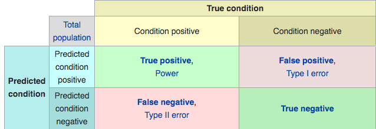

\newcommand{\Expect}[1]{E\left[ #1 \right]}
\newcommand{\Var}[1]{\mathbb{V}\left[ #1 \right]}
\newcommand{\Cov}[2]{\mathrm{Cov}\left[#1,\ #2\right]}

\newcommand{\E}{\mathbb{E}}
\renewcommand{\P}{\mathbb{P}}
\newcommand{\R}{\mathbb{R}}
\newcommand{\tr}[1]{\mbox{tr}(#1)}
\newcommand{\brt}{\widehat{\beta}_{r,t}}
\newcommand{\brl}{\widehat{\beta}_{r,\lambda}}
\newcommand{\bls}{\widehat{\beta}_{ls}}
\newcommand{\blt}{\widehat{\beta}_{l,t}}
\newcommand{\bll}{\widehat{\beta}_{l,\lambda}}

\newcommand{\argmin}[1]{\underset{#1}{\textrm{argmin}}}

\renewcommand{\vec}[1]{\underline{#1}}
\newcommand{\vX}{\vec{X}}
\newcommand{\X}{\vX}
\newcommand{\vx}{\vec{x}}
\newcommand{\vY}{\vec{Y}}
\newcommand{\vy}{\vec{y}}
\newcommand{\vbeta}{\vec{\beta}}
\newcommand{\bhat}{\widehat{\beta}}
\newcommand{\vbhat}{\vec{\widehat{\beta}}}
\newcommand{\sumin}{\sum_{i=1}^n}
\newcommand{\sumjp}{\sum_{j=1}^p}

\newcommand\given{\:\vert\:}


```{r setup, echo=FALSE,results='hide',include=FALSE}
# Need the knitr package to set chunk options
library(knitr)
# Set knitr options for knitting code into the report:
# - Don't print out code (echo)
# - Save results so that code blocks aren't re-run unless code changes (cache),
# _or_ a relevant earlier code block changed (autodep), but don't re-run if the
# only thing that changed was the comments (cache.comments)
# - Don't clutter R output with messages or warnings (message, warning)
  # This _will_ leave error messages showing up in the knitted report
opts_chunk$set(message=FALSE, warning=FALSE, fig.align='center',fig.width=8,
               fig.height=4,cache=TRUE,autodep=TRUE, global.par=TRUE)
par(las=1, bty='n', pch=19, ann=FALSE)
library(tidyverse)
library(gridExtra)
library(MASS)
#theme_set(theme_minimal(base_family="Times"))
green = '#00AF64'
blue = '#0B61A4'
red = '#FF4900'
orange = '#FF9200'
```

## Logistic Regression Summary

For now, we will consider the simple case of only two groups. 

Our response variable is $Y$,:

  * $Y = 0$ if we are in the first group.
  * $Y = 1$ if we are in the second group.

We model $Y$ using the Bernoulli distribution, a special case of the Binomial distribution.

$Y \given X=x \sim \text{Binomial}\left(1, p(\vx) \right)$

We classify observations based on the estimated value of $p(x)$, the conditional mean of $Y | X$.

According to logistic regression, our model for $p(\vx)$ is 

\[
p(\vx) = \dfrac{e^{\beta_0 + \beta_1x_1 + \beta_2x_2}}{1 + e^{\beta_0 + \beta_1x_1 + \beta_2x_2}}
\]

(This is the inverse logit function of $\beta_0 + \beta_1x_1 + \beta_2x_2$ )

Which we apply the logit function to.

\[
\log\left( \frac{p(\vx)}{1-p(\vx)} \right) = \beta_0 + \beta_1x_1 + \beta_2x_2
\]

## Logistic Regression As Linear Classifier

Logistic regression is one example of a _linear classifier_.

It produces a line (or plane or hyperplane) which _separates_ the two classes.

```{r def.plots, fig.width = 6}
Default <- read.csv(file = "data/Default.csv")

# Converting Balance and Income to Thousands of dollars

Default$balance <- Default$balance/1000
Default$income <- Default$income/1000

# Set an ifelse statement to handle the variable coding
#Create a new varible called def with the coded values

Default$def <- as.factor(ifelse(Default$default == "Yes", 1,0))

g <- ggplot(Default, aes(income, balance, shape = def, color = def)) +
  geom_point() +
  scale_shape_manual(values=c(1, 3))

g

default.fit <- glm(def ~ balance + income, family = binomial, data = Default)

summary(default.fit)
```

## The Line in Logistic Regression

Suppose we decide "Predict `1` if `predict(default.fit, type = "response") > 0.5`".

This means "For which combinations of `x1` and `x2` is
\[
\frac{\exp\left(\widehat{\beta}_0 + \widehat{\beta}_1 x_1 + \widehat{\beta}_2 x_2\right)}
{1+\exp\left(\widehat{\beta}_0 + \widehat{\beta}_1 x_1 + \widehat{\beta}_2 x_2\right)} > 0.5 ?
\]

Solving this gives
\[
\begin{aligned}
\widehat{\beta}_0 + \widehat{\beta}_1 x_1 + \widehat{\beta}_2 x_2 &> \log\left(\frac{0.5}{1-0.5}\right) \\
\Rightarrow x1 &> -\frac{\widehat{\beta}_0 + \widehat{\beta}_2 x_2}{\widehat{\beta}_1}
\end{aligned}
\]

Or

\[
x2 > -\frac{\widehat{\beta}_0 + \widehat{\beta}_1 x_1}{\widehat{\beta}_2}
\]

That's just a line. Let's plot it:
```{r}
cc = coefficients(default.fit)
g + geom_abline(intercept = -cc[1]/cc[2], slope = -cc[3]/cc[2], color=green)
```

## Inverse Logit Function

We call that line the "classification boundary"

* The inverse logit function looks like a ramp:
```{r}
logit <- function(z){ # can this take in any z?
  log(z)-log(1-z)
}
ilogit <- function(z){ # what about this one?
  exp(z)/(1+exp(z))
}

ggplot(data.frame(x=c(-10,10)), aes(x)) + stat_function(fun=ilogit) + 
  geom_vline(xintercept = 0, color=red) + ylab('probability')
```

Again, solving for where the equation crosses 0.5, gives us a "line".

Logistic regression always produces "linear" classification boundaries, so we call it a "linear classifier"

## Several Linear Boundaries

```{r}
# slightly modified from the text
sim.logistic <- function(X, beta.0, beta) {
  # Note: I'm passing in an x matrix => I need ncol(x)==length(beta)
  linear.parts = beta.0 + X%*%beta 
  y = as.factor(rbinom(nrow(X), size=1, prob=ilogit(linear.parts)))
  return(data.frame(y,X))
}

decision.boundary <- function(ddd){
  cc = coefficients(glm(y~X1+X2,data=ddd,family='binomial'))
  return(data.frame(intercept=-cc[1]/cc[3],slope=-cc[2]/cc[3]))
}

set.seed(999)
X <- matrix(runif(100*2, min=-1,max=1),ncol=2)

newdf = list() # Example of not so good programming, no preallocation.
## But lists are kind of weird to preallocate... Please forgive me/Dan!

for(i in 1:4){
  newdf[[i]] = sim.logistic(X, rnorm(1), rnorm(2,sd=3))
}

X <- matrix(runif(100*2, min=-1,max=1),ncol=2)

names(newdf) = letters[1:4]

newdf = data.table::rbindlist(newdf, idcol="index") %>% group_by(index)

dbs = newdf %>% do(decision.boundary(.))

ggplot(newdf, aes(X1,X2,color=y)) + geom_point() +
  facet_wrap(~index) +
  geom_abline(mapping=aes(intercept=intercept, slope=slope),data=dbs,color=green)

dbs

```

## Linear Discriminant Analysis

Linear Discriminant Analysis (__LDA__) is another way of creating a linear boundary. (Hence it's name.)

LDA easily lends itself to classifying $Y$ into more than 2 groups $K \geq 2$, but we will concentrate on the simplest case, $K=2$ for now.

We will approach its construction via the Bayes' Theroem:

First, we will define a few different things.

  * $f_k(x) = P(X=x \given Y = k)$
  * $\pi_k = P(Y = k)$
  
Then Bayes's Theroem gives 
  
\[
\begin{aligned}
  P(Y=k\given X=x) &= \frac{\pi_k\cdot f_k(x)}{\sum_{j = 1}^K \pi_j \cdot f_j(x)}\\
  &\equiv p_k(x)
\end{aligned}
\]

We refert to $p_k(x)$ as the __posterior probability__ that an obseration $X = x$ belongs in the $k^{th}$ group.

Estimating $\pi_k$ is pretty easy.

\[
\widehat{\pi}_k = \frac{\sum_{i=1}^n I(y = k)}{n} \equiv \frac{n_k}{n}
\]

$n_k$ is number observations in group $k$ and $n$ is the total number of observations.

Our issue is estimating $f_k(x)$. This is where we begin making assumptions.

## Formulating LDA, One Predictor Variable

We will start with having only one predictor variable, x.

```{r}
ggplot(Default, aes(x=balance, color=default)) +
  geom_histogram(aes(y = ..density..), fill="white", alpha=0.5, position="identity") +
  geom_density()
```

LDA tries to determine when we we classify an observations as group based on the distribution of the two groups. Where looks like a good place to divide the two groups based on `balance`?

## Using Normality for $f_k$, A Classic Stats Move

For having one predictor variable, we assume the normal distribution for $f_k(x$.

\[
f_k(x) = \frac{1}{\sqrt{2\pi}\sigma^2_k}\exp\left(-\frac{1}{2\sigma^2_k}(x - \mu_k)^2\right)
\]

Further, we assume the same variance for each distribution. 

\[
\sigma^2_1 = \sigma^2_2 = \dots = \sigma^2_K
\]

Then the posterior distribution becomes

\[
p_k(x) = \frac{\pi_k\cdot \frac{1}{\sqrt{2\pi}\sigma^2}\exp\left(-\frac{1}{2\sigma^2}(x - \mu_k)^2\right)}{\sum_{j = 1}^K \pi_j \cdot \frac{1}{\sqrt{2\pi}\sigma^2}\exp\left(-\frac{1}{2\sigma^2}(x - \mu_k)^2\right)}\\
\]

How does this become linear?

## Geting a Linear Classifier

When is $p_k(x)$ maximised?

  1. \[
    p_k(x) = \frac{\pi_k\cdot \frac{1}{\sqrt{2\pi}\sigma^2}\exp\left(-\frac{1}{2\sigma^2}(x - \mu_k)^2\right)}{\sum_{j = 1}^K \pi_j \cdot \frac{1}{\sqrt{2\pi}\sigma^2}\exp\left(-\frac{1}{2\sigma^2}(x - \mu_k)^2\right)}\\
    \]

  2. Take the log.
  
  3. $\cdots$ ("Easy" algebra.)
  
  4. \[
  \delta_k(x) = x \cdot \frac{\mu_k}{\sigma^2} - \frac{\mu_k^2}{2\sigma^2} + \log(\pi_k)
  \]
  
  It turns out that choosing $k$ such that $p_k$ is maximised is the same as choosing $k$ such that $\delta_k$ is maximised. ($\log$ is monotonic, proportionality, yadda yadda yadda, ...).
  
## Further simplification, Two Equally Likely Groups Groups! ($K=2$)

> __Example__

Suppose $K=2$ and $\pi_1 = \pi_2 = 0.5$. 

We assign an observation to being from class 1 if

\[
2x(\mu_1 - \mu_2) > \mu_1^2 - \mu_2^2
\]

What is our dividing line? Set $\delta_1(x) = \delta_2(x)$.

\[
x = \frac{\mu_1 + \mu_2}{2}
\]

Our dividing line between the two groups is the average of the two means. (If $\pi_1 \neq \pi_2$ then it changes based on this.)

```{r}
ggplot(data.frame(x = c(-5, 5)), aes(x)) + 
  stat_function(fun = dnorm, args = list(mean = -1.5, sd = 1), col='red') +
  stat_function(fun = dnorm, args = list(mean = 1.5, sd = 1), col='blue') +
  geom_vline(xintercept = 0)
```

## Estimating $\mu_k$ and $\sigma^2$, The Obvious Choices

It would be quite the rare situation where we know $\pi_k, \mu_k,$ and $\sigma^2$. We use the usual estimates:

\[
\begin{aligned}
\widehat{\pi}_k &= \frac{n_k}{n}\\
\\
\widehat{\mu}_k & = \frac{1}{n_k}\sum_{i:y_i = k}x_i \\
\\
\widehat{\sigma}^2 &= \frac{1}{n - K}\sum_{i=1}^K \sum_{i:y_i = k}(x_i - \widehat{\mu}_k)
\end{aligned}
\]


```{r}
n = 20
set.seed(999)
df <- data.frame(x = c(rnorm(n, -1.5, 1), rnorm(n, 1.5, 1)), group = as.factor(c(rep(1, n), rep(2, n))))

summary <- df %>%
  group_by(group) %>%
  summarise(mean=mean(x), var = var(x))

sigsq <- mean(summary$var)

ggplot(df, aes(x=x, color = group, fill = group)) + geom_histogram(alpha=0.5, position="identity") +
  geom_vline(xintercept = 0) + 
  geom_vline(xintercept = mean(summary$mean), linetype = "dashed", color = "purple")
```

## Unequal Sample Sizes

When we have two groups and the sample sizes are unequal, then our estimates of $\pi_1$ and $pi_2$ are unequal.

To find the dividing line between the groups, we have to rely on the full form of $\delta_k(x)$.

\[
\delta_k(x) = x \cdot \frac{\mu_k}{\sigma^2} - \frac{\mu_k^2}{2\sigma^2} + \log(\pi_k)
\]

We set $\delta_1(x) = \delta_2(x)$.

\[
\begin{aligned}
x \cdot \frac{\mu_1}{\sigma^2} - \frac{\mu_1^2}{2\sigma^2} + \log(\pi_1) &= x \cdot \frac{\mu_2}{\sigma^2} - \frac{\mu_2^2}{2\sigma^2} + \log(\pi_2)\\
\to x &= \frac{\mu_1 + \mu_2}{2} + \frac{\sigma^2\log\left(\frac{\pi_2}{\pi_1}\right)}{\mu_1-\mu_2}
\end{aligned}
\]

Just like before, we substitute our estimates of the parameters.


## Applying to the `Default` Data

```{r}

def.stats <- Default %>%
  group_by(default) %>%
  summarise(mean=mean(balance), var = var(balance))

n <- nrow(Default)
n1 <- sum(Default$default=="No"); n2 <- sum(Default$default=="Yes")
pi1 <- n1/n; pi2 <- n2/n

mu1 <- def.stats$mean[1]; mu2 <- def.stats$mean[2]

sigsq <-((n1-1)*def.stats$var[1] + (n2-1)*def.stats$var[2])/(n1+n2-2)

div.line <- (mu1 + mu2)/2 + sigsq*log(pi2/pi1)/(mu1 - mu2)
```

Summary Statistics:

  * $\widehat{\mu_1} = `r def.stats$mean[1]`$ and $\widehat{\mu_2} = `r def.stats$mean[2]`$
  * $\widehat{\pi}_1 = `r pi1`$ and $\widehat{\pi}_2 = `r pi2`$
  * $\widehat{\sigma}^2 = `r sigsq`$

This gives us the dividing line for the groups:

\[
x = `r div.line`
\]

```{r}

ggplot(Default, aes(x=balance, color=default)) +
  geom_histogram(aes(y = ..density..), fill="white", alpha=0.5, position="identity") +
  geom_vline(xintercept = div.line, linetype = "dashed", color = "purple") +
  geom_density()
```

But why is the line so far to the right?

```{r}
ggplot(Default, aes(x=balance, color=default)) +
  geom_histogram(fill="white", alpha=0.5, position="identity") +
  geom_vline(xintercept = div.line, linetype = "dashed", color = "purple")
```

## `lda` function

If we are using `R`, LDA is fairly "easy" to do. It is part of the `MASS` library.

```{r, eval = F}
library(MASS)
?lda
```

`lda(formula, data)`

  * `formula = y ~ x1 + x2 ... xK` as usual.
  * `data = your.data.frame`
  
And your done.

This does product some basic summary information, but it won't help you actually SEE the decision boundary. That actually is ridiculously tedious.

```{r}

def.lda <- lda(default ~ balance, Default)

def.lda
```

## How well does LDA do?

There are multiple ways of investigating how well classification is performed:

  * Overall misclassification rate.
  * False Positive Rate
  * False Negative Rate
  * True Positive Rate (Sensitivity)
  * True Negative Rate (Specificity)





Below is the misclassification rate.
```{r}

pred.lda <- predict(def.lda)

names(pred.lda)
```

* __class__: The predicted class of an observation.
* __posterior__: The posterior probability that an observation belongs in each group.

```{r}
pred.class <- pred.lda$class

mean(pred.class != Default$default)

# Verfying this is equivalent to the manually computed LDA rule
manual.class <- ifelse(Default$balance > div.line, "Yes", "No")
mean(manual.class != Default$default)

library(caret)

confusionMatrix(pred.class, Default$default)
```

But what if we just classified everyone as not defaulting?

```{r}
mean(Default$default != "No")
```

How do we improve this?

## Different Boundaries for Groups

Previously we had been looking at assign an observation to a group if that group's probability were greater than $0.5$.

\[
P(\text{default = Yes}\given \text{balance}) > 0.5
\]

A credit card company may want to be fairly conservative and set a different boundary.

\[
P(\text{default = Yes}\given \text{balance}) > 0.2 ?
\]

```{r}

pred.class2 <- as.factor(ifelse(pred.lda$posterior[,2] > 0.2, "Yes", "No"))
mean(pred.class != Default$default)

confusionMatrix(pred.class2, Default$default)

mean(pred.class2 != Default$default)

```

## ROC Curve

A common tool of visualizing how a classifier performs under different thresholds is the ROC curve.

It is a display of the true positive rate and false positive rate as the classification threshold changes.

```{r}
library(pROC)
myRoc <- roc(response = Default$default, predictor = pred.lda$posterior[,2], positive = 'Yes')

def.roc <- data.frame(Sensitivity=myRoc$sensitivities,
                      FPR = 1- myRoc$specificities,
                      Threshold = myRoc$thresholds)  

ggplot(def.roc, aes(x = FPR, y = Sensitivity)) + geom_line() +
  geom_abline(slope = 1, intercept = 0, color = "red", alpha = 0.5)

```


