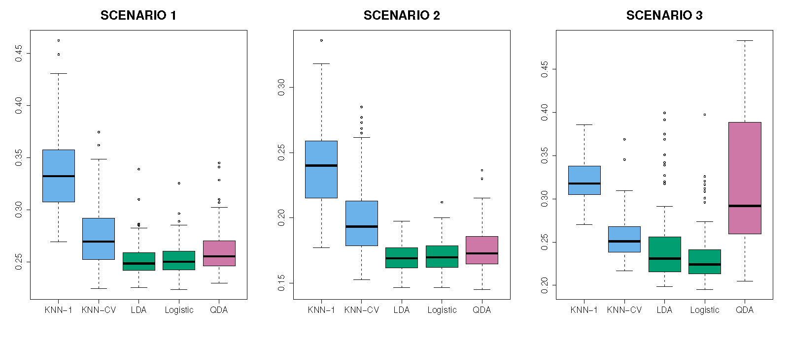
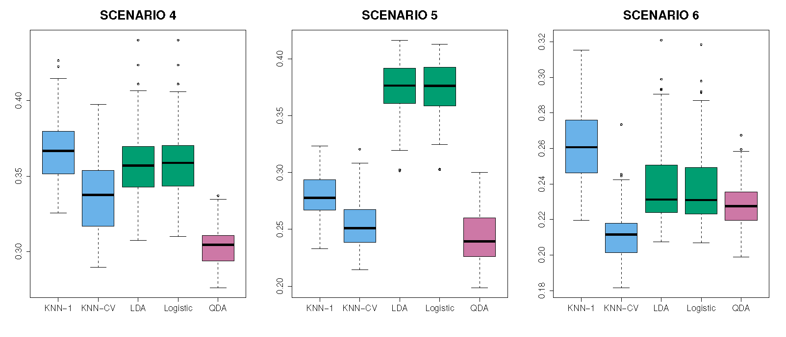

\newcommand{\Expect}[1]{E\left[ #1 \right]}
\newcommand{\Var}[1]{\mathbb{V}\left[ #1 \right]}
\newcommand{\Cov}[2]{\mathrm{Cov}\left[#1,\ #2\right]}

\newcommand{\E}{\mathbb{E}}
\renewcommand{\P}{\mathbb{P}}
\newcommand{\R}{\mathbb{R}}
\newcommand{\tr}[1]{\mbox{tr}(#1)}
\newcommand{\brt}{\widehat{\beta}_{r,t}}
\newcommand{\brl}{\widehat{\beta}_{r,\lambda}}
\newcommand{\bls}{\widehat{\beta}_{ls}}
\newcommand{\blt}{\widehat{\beta}_{l,t}}
\newcommand{\bll}{\widehat{\beta}_{l,\lambda}}

\newcommand{\argmin}[1]{\underset{#1}{\textrm{argmin}}}

\renewcommand{\vec}[1]{\underline{#1}}
\newcommand{\vX}{\vec{X}}
\newcommand{\X}{\vX}
\newcommand{\vx}{\vec{x}}
\newcommand{\vY}{\vec{Y}}
\newcommand{\vy}{\vec{y}}
\newcommand{\vmu}{\vec{\mu}}
\newcommand{\vSigma}{\vec{\Sigma}}
\newcommand{\vbeta}{\vec{\beta}}
\newcommand{\bhat}{\widehat{\beta}}
\newcommand{\vbhat}{\vec{\widehat{\beta}}}
\newcommand{\sumin}{\sum_{i=1}^n}
\newcommand{\sumjp}{\sum_{j=1}^p}

\newcommand\given{\:\vert\:}


```{r setup, echo=FALSE,results='hide',include=FALSE}
# Need the knitr package to set chunk options
library(knitr)
# Set knitr options for knitting code into the report:
# - Don't print out code (echo)
# - Save results so that code blocks aren't re-run unless code changes (cache),
# _or_ a relevant earlier code block changed (autodep), but don't re-run if the
# only thing that changed was the comments (cache.comments)
# - Don't clutter R output with messages or warnings (message, warning)
  # This _will_ leave error messages showing up in the knitted report
opts_chunk$set(message=FALSE, warning=FALSE, fig.align='center',fig.width=8,
               fig.height=4,cache=TRUE,autodep=TRUE, global.par=TRUE)
par(las=1, bty='n', pch=19, ann=FALSE)
library(tidyverse)
library(gridExtra)
library(MASS)
#theme_set(theme_minimal(base_family="Times"))
green = '#00AF64'
blue = '#0B61A4'
red = '#FF4900'
orange = '#FF9200'

set.seed(111)
```

## Review of Basics of LDA

We will approach its construction via the Bayes' Theroem:

First, we will define a few different things.

  * $f_k(x) = P(X=x \given Y = k)$
  * $\pi_k = P(Y = k)$
  
Then Bayes's Theroem gives 
  
\[
\begin{aligned}
  P(Y=k\given X=x) &= \frac{\pi_k\cdot f_k(x)}{\sum_{j = 1}^K \pi_j \cdot f_j(x)}\\
  &\equiv p_k(x)
\end{aligned}
\]

We refer to $p_k(x)$ as the __posterior probability__ that an obseration $X = x$ belongs in the $k^{th}$ group.

\[
f_k(x) = \frac{1}{\sqrt{2\pi}\sigma^2_k}\exp\left(-\frac{1}{2\sigma^2_k}(x - \mu_k)^2\right)
\]

Further, we assumed the same variance for each distribution. 

\[
\sigma^2_1 = \sigma^2_2 = \dots = \sigma^2_K
\]

Then the posterior distribution becomes

\[
p_k(x) = \frac{\pi_k\cdot \frac{1}{\sqrt{2\pi}\sigma^2}\exp\left(-\frac{1}{2\sigma^2}(x - \mu_k)^2\right)}{\sum_{j = 1}^K \pi_j \cdot \frac{1}{\sqrt{2\pi}\sigma^2}\exp\left(-\frac{1}{2\sigma^2}(x - \mu_k)^2\right)}\\
\]

## Multivariate Normal Distribution

The general format is the same, except now that we have multiple predictors, we assume that the distribution for the predictors is a __Multivariate Normal Distribution__ for each group.

Let $\vX = (X_1, \dots X_p)^\top \sim MVN\left(\vmu, \vSigma\right)$

$$
f(\vx) = \frac{1}{(2\pi)^{p/2} |\vSigma|^{1/2}}\exp\left(-\frac{1}{2}(\vx-\vmu)^\top\vSigma^{-1}(\vx-\vmu)\right)
$$

  * $\vmu$ is the vector of means for $\vX$.
  
  * $\vSigma$ is the covariance matrix:
  
  $$\vSigma = \begin{bmatrix}
\sigma^2_1 & \sigma_{12} & \sigma_{13} & \dots & \sigma_{1p}\\
\sigma_{21} & \sigma^2_{2} & \sigma_{23} & \dots & \sigma_{2p}\\
\vdots & & & &\vdots\\
\sigma_{p1} & \sigma_{p2} & \sigma_{p3} & \dots & \sigma^2_{p}
\end{bmatrix} $$

Estimating this involves estimating $\frac{p(p+1)}{2}$ parameterers unless we assume some sort of structure for $\vSigma$

* Independence of the $X_j$'s $\iff \sigma_{ij} = 0$ for $i\neq j$ (This statement is restricted to the normal distribution. It is not always the case that $\sigma_{ij} = 0$ implies independence of random variables.)

## LDA With More Two Or More Predictors


* Suppose $\vX_i \given Y_i=1 \sim N(\vmu_1, \vSigma)$

* And $\vX_i \given Y_i=0 \sim N(\vmu_0, \vSigma)$

Note that these share $\vSigma$.

Suppose that $P(Y_i=1)=\pi_1$

__Bayes Rule:__
\[
P(Y_i=1 \given \vX_i=\vx) = \frac{P(\vX_i \given Y_i=1)\pi_1}
{P(\vX_i \given Y_i=1)\pi_1 + P(\vX_i \given Y_i=0)\pi_0}
\]

So if we know $\pi_1, \vmu_1, \vmu_0, \vSigma$, then we can find $P(Y_i=1\given \vX)$

## Simplification

\[
\begin{aligned}
\frac{P(\vX_i=\vx \given Y_i=1)\pi_1}
{P(\vX_i=\vx \given Y_i=1)\pi_1 + P(\vX_i=\vx \given Y_i=0)\pi_0}
&= \frac{\pi_1 \frac{1}{(2\pi|\vSigma|)^{p/2}}\exp\left(-\frac{1}{2}(\vx-\vmu_1)^\top 
\vSigma^{-1} (\vx-\vmu_1) \right)}
{\sum_{j=0,1}\pi_j\frac{1}{(2\pi|\vSigma|)^{p/2}}\exp\left(-\frac{1}{2}(\vx-\vmu_j)^\top 
\vSigma^{-1} (\vx-\vmu_j) \right)}\\
&= (\textrm{take logs})\\
&= \ldots\\
&=\vx^\top\vSigma^{-1}\vmu_1-\frac{1}{2}\vmu_1^\top \Sigma^{-1}\vmu_1 + \log\pi_1\\
&=: \delta_1(\vx)
\end{aligned}
\]

* If this is bigger than $\delta_0$, we predict __1__ else __0__.

## Why is this linear?

We are indifferent when $\delta_1=\delta_0$

\[
\begin{aligned}
&\delta_1=\delta_0\\ 
&\Rightarrow \vx^\top\vSigma^{-1}\vmu_1-\frac{1}{2}\vmu_1^\top \vSigma^{-1}\vmu_1 + \log\pi_1 = 
\vx^\top\vSigma^{-1}\vmu_0-\frac{1}{2}\vmu_0^\top \vSigma^{-1}\vmu_0 + \log\pi_0\\
&\Rightarrow \vx^\top\vSigma^{-1}(\vmu_1-\vmu_0) -\frac{1}{2}\left(\vmu_1^\top \vSigma^{-1}\vmu_1 -
\vmu_0^\top \vSigma^{-1}\vmu_0\right) + \log\pi_1-\log\pi_0 = 0
\end{aligned}
\]

The slope is $(\vmu_1-\vmu_0)^\top \vSigma^{-1}$ 

The intercept is $-\frac{1}{2}\left(\vmu_0^\top\vSigma^{-1}\vmu_0-
\vmu_1^\top\vSigma^{-1}\vmu_1\right)+\log \pi_1-\log\pi_0$

## Example

```{r}
library(mvtnorm)
n = 100
pi1 = 0.5
n1 = floor(n*pi1); n0 = n-n1
mu1 = c(1,1); mu0 = c(-1,-1)
Sigma = 2*diag(2)
X1 = rmvnorm(n1, mu1, Sigma) 
X2 = rmvnorm(n0, mu0, Sigma)
X = rbind(X1,X2)
Y = factor(c(rep(1,n1),rep(0,n0)))
df = data.frame(Y,X)
g <- ggplot(df, aes(X1,X2,color=Y)) + geom_point() + scale_color_manual(values=c(blue,red))
g
```

## Decision Boundary Using Real Parameters (Not Estimates)

```{r}
Sinv = solve(Sigma)
slope.vec = t(mu1-mu0) %*% Sinv
intercept = 0.5*(t(mu0) %*% Sinv %*% mu0 - t(mu1) %*% Sinv %*% mu1)
g + stat_ellipse(type='norm') + # these are estimated, not the truth
  geom_abline(intercept = -intercept/slope.vec[2], 
              slope = -slope.vec[1]/slope.vec[2], color=green)
```

## Correlated Predictors

```{r}
mu1 = c(1,2); mu0 = c(1,-1)
Sigma = 2*matrix(c(1,-.5,-.5,1),2)
X1 = rmvnorm(n1, mu1, Sigma) 
X2 = rmvnorm(n0, mu0, Sigma)
X = rbind(X1,X2)
Y = factor(c(rep(1,n1),rep(0,n0)))
df = data.frame(Y,X)
Sinv = solve(Sigma)
slope.vec = t(mu1-mu0) %*% Sinv
intercept = 0.5*(t(mu0) %*% Sinv %*% mu0 - t(mu1) %*% Sinv %*% mu1)
ggplot(df, aes(X1,X2,color=Y)) + geom_point() + scale_color_manual(values=c(blue,red)) +
  stat_ellipse(type='norm') + 
  geom_abline(intercept = -intercept/slope.vec[2], 
              slope = -slope.vec[1]/slope.vec[2], color=green)
```

* Note: here there is a single $\Sigma$, but I don't know how to plot ellipses in `ggplot`. So these are estimated.


## Same but $n$ Largeer

```{r}
n1=500; n0=500
X1 = rmvnorm(n1, mu1, Sigma) 
X2 = rmvnorm(n0, mu0, Sigma)
X = rbind(X1,X2)
Y = factor(c(rep(1,n1),rep(0,n0)))
df = data.frame(Y,X)
Sinv = solve(Sigma)
slope.vec = t(mu1-mu0) %*% Sinv
intercept = 0.5*(t(mu0) %*% Sinv %*% mu0 - t(mu1) %*% Sinv %*% mu1)
ggplot(df, aes(X1,X2,color=Y)) + geom_point() + scale_color_manual(values=c(blue,red)) +
  stat_ellipse(type='norm') + 
  geom_abline(intercept = -intercept/slope.vec[2], 
              slope = -slope.vec[1]/slope.vec[2], color=green)
```

## Same one, but change P(Y=1)

```{r}

n1=75; n0=25

X1 = rmvnorm(n1, mu1, Sigma) 
X2 = rmvnorm(n0, mu0, Sigma)

X = rbind(X1,X2)
y = factor(c(rep(1,n1),rep(0,n0)))
df = data.frame(y,X)
Sinv = solve(Sigma)
slope.vec = t(mu1-mu0) %*% Sinv
intercept = 0.5*(t(mu0) %*% Sinv %*% mu0 - t(mu1) %*% Sinv %*% mu1) + log(.75) - log(.25)
ggplot(df, aes(X1,X2,color=y)) + geom_point() + scale_color_manual(values=c(blue,red)) +
  stat_ellipse(type='norm') + 
  geom_abline(intercept = -intercept/slope.vec[2], 
              slope = -slope.vec[1]/slope.vec[2], color=green)
```

## Using Sample Data

Estimate everything with sample analogues

* $\widehat{\pi}_1 = n_1/(n_1+n_0)$

* $\widehat{\vmu}_1 = \frac{1}{n_1}\sum \vX_i I(Y_i=1)$. Same for $\widehat{\vmu}_0$.

* $\widehat{\vSigma} = \frac{1}{n}\sum_{ij} I(Y_i=j)(\vX_i-\widehat{\vmu}_j)^\top(\vX_i-\widehat{\vmu}_j)$
```{r}

lda.disc <- function(fit,df){
  
  pi0 = fit$prior[1]
  pi1 = fit$prior[2]
  
  mu0 = fit$means[1,]
  mu1 = fit$means[2,]
  
  S = pi0*cov(filter(df,y==0)[,-1]) + pi1*cov(filter(df,y==1)[,-1])
  
  Sinv = solve(S)
  
  slope.vec = t(mu1-mu0) %*% Sinv
  intercept = 0.5*(t(mu0) %*% Sinv %*% mu0 - t(mu1) %*% Sinv %*% mu1) + log(pi1) - log(pi0)
  
  int = -intercept/slope.vec[2]
  sl = -slope.vec[1]/slope.vec[2]
  
  return(data.frame(intercept=int,slope=sl))
}
```


```{r}
# Compute the decision boundary for logistic regression
decision.boundary <- function(ddd){
  cc = coefficients(glm(y~X1+X2,data=ddd,family='binomial'))
  return(data.frame(intercept=-cc[1]/cc[3],slope=-cc[2]/cc[3]))
}

library(MASS)

lda.fit = lda(y~X1+X2, data=df) 

sl.int = lda.disc(lda.fit,df)

log.bd = decision.boundary(df)

truth = data.frame(intercept=-intercept/slope.vec[2], slope=-slope.vec[1]/slope.vec[2])

dfa = rbind(sl.int,log.bd,truth)
dfa$discriminant = c('lda','logistic','truth')

ggplot(df, aes(X1,X2,color=y)) + geom_point() + scale_color_brewer(palette = 'Set1')+
  stat_ellipse(type='norm') + 
  geom_abline(mapping=aes(intercept=intercept, slope=slope,color=discriminant),data=dfa)
```

## Comparing LDA and Logistic regression

Both are linear in $x$:  

  - LDA$\longrightarrow \alpha_0 + \alpha_1^\top x$ 
  - Logit$\longrightarrow \beta_0 + \beta_1^\top x$.

But the parameters are estimated differently.

Examine the joint distribution of $(X,y)$:  

  * LDA $\prod_i f(x_i,y_i) = \underbrace{\prod_i f(X_i | y_i)}_{\textrm{Gaussian}}\underbrace{\prod_i f(y_i)}_{\textrm{Bernoulli}}$
  * Logistic $\prod_i f(x_i,y_i) = \underbrace{\prod_i f(y_i | X_i)}_{\textrm{Logistic}}\underbrace{\prod_i f(X_i)}_{\textrm{Ignored}}$
  
LDA estimates the joint, but Logistic estimates only the conditional distribution. But this is really all we need.

  * So logistic requires fewer assumptions.

  * But if the two classes are perfectly separable, logistic crashes (and the MLE is undefined)

  * LDA works even if the conditional isn't normal, but works poorly if any X is qualitative

## QDA

QDA is __Quadratic Discriminant Analysis__

  * Like LDA we get a function that creates a boundary for classification at $P(Y\given\vX)=0.5$

Start like LDA, but let $\vSigma_1 \neq \vSigma_0$.

This gives a "quadratic" decision boundary (it's a curve).

\[
\begin{aligned}
\delta_1(\vx) &= -\frac{1}{2}(\vx - \vmu_1)^\top\vSigma_1^{-1}(\vx-\vmu) -\frac{1}{2}\log|\vSigma_1| +\log(\pi_1) \\
&= -\frac{1}{2}\vx^\top\vSigma_1^{-1}\vx + \vx^\top\vSigma_1^{-1}\vmu_1 -\frac{1}{2}\vmu_1^\top\vSigma_1^{-1}\vmu_1 -\frac{1}{2}\log|\vSigma_1| +\log(\pi_1)
\end{aligned}
\]

If we have many columns in $X$ ($p$)

  - Logistic estimates $p+1$ parameters
  - LDA estimates $2p + p(p+1)/2 + 1$
  - QDA estimates $2p + p(p+1) + 1$
  
If $p=50$,

  - Logistic: 51
  - LDA: 1376
  - QDA: 2651
  
QDA doesn't get used much: there are better nonlinear versions with fewer parameters (SVMs)


```{r qda-pred}
n1=50; n0=50
Sigma1 = matrix(c(2,.8,.8,1),2)
Sigma0 = matrix(c(1,-.5,-.5,2),2)

 
X1 = rmvnorm(n1, mu1, Sigma1) 
X2 = rmvnorm(n0, mu0, Sigma0)
X = rbind(X1,X2)

y = factor(c(rep(1,n1),rep(0,n0)))

df = data.frame(y,X)

qda.fit = qda(y~X1+X2, data=df)
lda.fit = lda(y~X1+X2, data=df)

pred.grid = expand.grid(X1=seq(min(df$X1),max(df$X1),len=100),
                        X2=seq(min(df$X2),max(df$X2),len=100))

pred.grid$qda = predict(qda.fit, newdata=pred.grid)$class
pred.grid$lda = predict(lda.fit, newdata=pred.grid)$class

pg = gather(pred.grid,key='key',value='predictions',-c(X1,X2))

ggplot(pg, aes(X1,X2)) + geom_raster(aes(fill=predictions)) +
  facet_wrap(~key) + scale_fill_brewer()+
  geom_point(data=df,mapping=aes(X1,X2,color=y)) +
  scale_color_brewer(palette = 'Set1')
```

##K Nearest Neighbors (Review from before)

We talked a little about KNN at the beginning of the course. That was under a purely regression setting where our response was continuous.

The general algorithm:
  
  1. Pick $k$
  2. Pick an estimation point, $x_0$
  3. Average the $y_i$'s with the $k$ nearest $x_i$'s to $x_0$
  4. This average is the predicted value of $y$ at $x_0$
  
```{r, fig.height = 9, fig.align='center', fig.width=8, echo=FALSE}

library(FNN)
library(MASS)
data(Boston)

boston_idx = sample(1:nrow(Boston), size = 250)
trn_boston = Boston[boston_idx, ]
tst_boston  = Boston[-boston_idx, ]

X_trn_boston = trn_boston["lstat"]
X_tst_boston = tst_boston["lstat"]
y_trn_boston = trn_boston["medv"]
y_tst_boston = tst_boston["medv"]

X_trn_boston_min = min(X_trn_boston)
X_trn_boston_max = max(X_trn_boston)
lstat_grid = data.frame(lstat = seq(X_trn_boston_min, X_trn_boston_max, 
                                    by = 0.01))
pred_001 = knn.reg(train = X_trn_boston, test = lstat_grid, y = y_trn_boston, k = 1)
pred_005 = knn.reg(train = X_trn_boston, test = lstat_grid, y = y_trn_boston, k = 5)
pred_010 = knn.reg(train = X_trn_boston, test = lstat_grid, y = y_trn_boston, k = 10)
pred_050 = knn.reg(train = X_trn_boston, test = lstat_grid, y = y_trn_boston, k = 50)
pred_100 = knn.reg(train = X_trn_boston, test = lstat_grid, y = y_trn_boston, k = 100)
pred_250 = knn.reg(train = X_trn_boston, test = lstat_grid, y = y_trn_boston, k = 250)

par(mfrow = c(3, 2))

plot(medv ~ lstat, data = trn_boston, cex = .8, col = "dodgerblue", main = "k = 1")
lines(lstat_grid$lstat, pred_001$pred, col = "darkorange", lwd = 0.25)

plot(medv ~ lstat, data = trn_boston, cex = .8, col = "dodgerblue", main = "k = 5")
lines(lstat_grid$lstat, pred_005$pred, col = "darkorange", lwd = 0.75)

plot(medv ~ lstat, data = trn_boston, cex = .8, col = "dodgerblue", main = "k = 10")
lines(lstat_grid$lstat, pred_010$pred, col = "darkorange", lwd = 1)

plot(medv ~ lstat, data = trn_boston, cex = .8, col = "dodgerblue", main = "k = 25")
lines(lstat_grid$lstat, pred_050$pred, col = "darkorange", lwd = 1.5)

plot(medv ~ lstat, data = trn_boston, cex = .8, col = "dodgerblue", main = "k = 50")
lines(lstat_grid$lstat, pred_100$pred, col = "darkorange", lwd = 2)

plot(medv ~ lstat, data = trn_boston, cex = .8, col = "dodgerblue", main = "k = 250")
lines(lstat_grid$lstat, pred_250$pred, col = "darkorange", lwd = 2)
```

## KNN in Classification.

In classification, the premise is the same. 

  1. For a point $\vx_0$, find the K observations closest to $x_0$. Call this set of points $M_0$.

  2. Then count number of points in $M_0$ for which $y_i = 1$.
  
  3. Use this to estimate $P(Y = 1\given \vX=\vx_0)$

$\widehat{P(Y = 1\given \vX = \vx_0)} = \frac{1}{K}\sum_{i\in M_0}I()$

Why would we not choose $K$ to be even, e.g., $K = 2$ or $K=4$?

```{r save.seeded.data, cache = T}

pred.grid = expand.grid(X1=seq(min(df$X1),max(df$X1),len=100),
                        X2=seq(min(df$X2),max(df$X2),len=100))

library(class)

pred.grid = expand.grid(X1=seq(min(df$X1),max(df$X1),len=100),
                        X2=seq(min(df$X2),max(df$X2),len=100))

pred.grid$knn3 = knn(df[,-1], pred.grid, df$y, k=3)

ggplot(pred.grid, aes(X1,X2)) + geom_raster(aes(fill=knn3)) +
  scale_fill_brewer() + geom_point(data=df,mapping=aes(X1,X2,color=y)) +
                        scale_color_brewer(palette = 'Set1')
```

## Choosing K

Choosing $K$ is very important.

```{r}
pred.grid$knn1 = knn(df[,-1], pred.grid[,1:2], df$y, k=1)
pred.grid$knn5 = knn(df[,-1], pred.grid[,1:2], df$y, k=5)
pred.grid$knn10 = knn(df[,-1], pred.grid[,1:2], df$y, k=10)
pred.grid$knn20 = knn(df[,-1], pred.grid[,1:2], df$y, k=20)
pg = gather(pred.grid,key='k',value='knn',-c(X1,X2))

ggplot(pg, aes(X1,X2)) + geom_raster(aes(fill=knn)) +
  facet_wrap(~k,labeller = label_both) + scale_fill_brewer()+
  geom_point(data=df,mapping=aes(X1,X2,color=y)) +
  scale_color_brewer(palette = 'Set1')
```

How should we choose $K$?

Scaling is also very important. The nearest neighbors are determined by their distance, so better to standardize your data first.

## `knn.cv`

```{r}
kmax = 100
err = double(kmax)
for(ii in 1:kmax){
  pk = knn.cv(df[,-1],df$y, k=ii) # does leave one out CV
  err[ii] = mean(pk != df$y)
}
ggplot(data.frame(k=1:kmax,error=err), aes(k,error))  +
  geom_line(color=red)

best.k <- max(which(err == min(err)))

best.k
```

I would use the __largest__ `K` that is close to the minimum (or at). This produces simpler, smoother, decision boundaries. (Why?)

```{r}
pred.grid$knnbest = knn(df[,-1], pred.grid[,1:2], df$y, k=best.k)
ggplot(pred.grid, aes(X1,X2)) + geom_raster(aes(fill=knnbest)) +
  scale_fill_brewer() + geom_point(data=df,mapping=aes(X1,X2,color=y)) +
                        scale_color_brewer(palette = 'Set1')

(tt <- table(knn(df[,-1],df[,-1],df$y,k=best.k),df$y,dnn=c('predicted','truth')))
1-sum(diag(tt))/sum(tt)
```
## Comparing LDA, Logistic Regression, QDA, KNN

Let's take that previous example. What is the shape of the boundary? What methods might we expect to work best.

There are various scenarios that we may want to consider.

Scenarios, each with two classes, and two predictors variables:

1. Observations within each class generated were uncorrelated normal distributions.

2. Same, but the two predictors had a correlations

3. Predictors generated from t-distributions instead of normal. Uncorrelated.

4. Data generated from normal distribution with a correlation of 0.5 in the first class, and -0.5 in the second class.

5. Observations were generated rom a normal distribution with uncorrelated predictors. The responses (Y's) were sampled from the logistic function using $X_1^2$ and $X_2^2$

6. A more complicated function was used to generated the responses (Y's).

## Test Errors in the Scenarios




Images courtesy of ISLR. Thanks!
