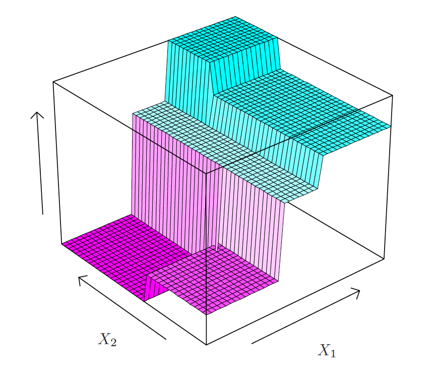
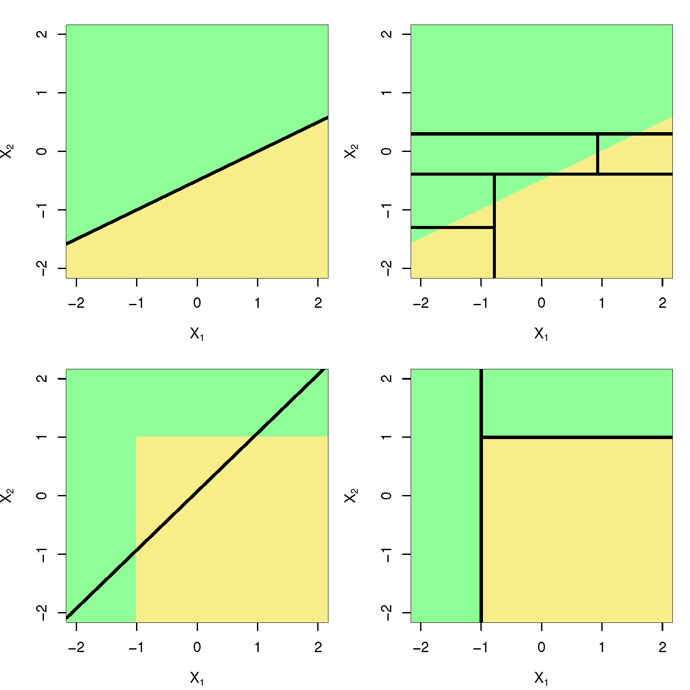

\newcommand{\Expect}[1]{E\left[ #1 \right]}
\newcommand{\Var}[1]{\mathbb{V}\left[ #1 \right]}
\newcommand{\Cov}[2]{\mathrm{Cov}\left[#1,\ #2\right]}

\newcommand{\E}{\mathbb{E}}
\renewcommand{\P}{\mathbb{P}}
\newcommand{\R}{\mathbb{R}}
\newcommand{\tr}[1]{\mbox{tr}(#1)}
\newcommand{\brt}{\widehat{\beta}_{r,t}}
\newcommand{\brl}{\widehat{\beta}_{r,\lambda}}
\newcommand{\bls}{\widehat{\beta}_{ls}}
\newcommand{\blt}{\widehat{\beta}_{l,t}}
\newcommand{\bll}{\widehat{\beta}_{l,\lambda}}

\newcommand{\argmin}[1]{\underset{#1}{\textrm{argmin}}}

\renewcommand{\vec}[1]{\underline{#1}}
\newcommand{\vX}{\vec{X}}
\newcommand{\X}{\vX}
\newcommand{\vx}{\vec{x}}
\newcommand{\vY}{\vec{Y}}
\newcommand{\vy}{\vec{y}}
\newcommand{\vmu}{\vec{\mu}}
\newcommand{\vSigma}{\vec{\Sigma}}
\newcommand{\vbeta}{\vec{\beta}}
\newcommand{\bhat}{\widehat{\beta}}
\newcommand{\vbhat}{\vec{\widehat{\beta}}}
\newcommand{\sumin}{\sum_{i=1}^n}
\newcommand{\sumjp}{\sum_{j=1}^p}

\newcommand\given{\:\vert\:}


```{r setup, echo=FALSE,results='hide',include=FALSE}
# Need the knitr package to set chunk options
library(knitr)
# Set knitr options for knitting code into the report:
# - Don't print out code (echo)
# - Save results so that code blocks aren't re-run unless code changes (cache),
# _or_ a relevant earlier code block changed (autodep), but don't re-run if the
# only thing that changed was the comments (cache.comments)
# - Don't clutter R output with messages or warnings (message, warning)
  # This _will_ leave error messages showing up in the knitted report
opts_chunk$set(message=FALSE, warning=FALSE, fig.align='center',fig.width=8,
               fig.height=4,cache=TRUE,autodep=TRUE, global.par=TRUE)
par(las=1, bty='n', pch=19, ann=FALSE)
library(tidyverse)
library(gridExtra)
library(MASS)
library(e1071)
library(ggplot2)
library(ellipse)
#theme_set(theme_minimal(base_family="Times"))
green = '#00AF64'
blue = '#0B61A4'
red = '#FF4900'
orange = '#FF9200'

set.seed(111)
```

## Introduction

Objective throughout this whole class: Predict a response variable $Y$ using predictors $X_1, X_2, \dots, X_p$.

Previously we have looked at __global models__ much of the time.

We assumed there was some formula of the predictors that would model the values of the response:

\[
\mu_{y\given x} = f(\vX)
\]

We assume this model holds over the _whole_ space of our predictors.

  * What if there are a lot of complicated predictors?
  * What if $f$ is a non-linear function?
  * What if the relationship between $Y$ and the predictors is very different for different regions of the predictors?
  * Complicated models can be very difficult to find formulas that approximate them well.
  
We have gone over a couple non-parametric methods: kernel smoothing and KNN.

Next we will look at Classification and Regression trees.

## Example Data, California Median House Prices

What patterns do you see in median housing prices? 

```{r, fig.height = 8}
calif <- read.table("http://www.stat.cmu.edu/~cshalizi/350/hw/06/cadata.dat",
header = TRUE)

head(calif)

price.deciles <- quantile(calif$MedianHouseValue, 0:10/10)
cut.prices <- cut(calif$MedianHouseValue, price.deciles, include.lowest = TRUE)
plot(calif$Longitude, calif$Latitude, col = grey(10:2/11)[cut.prices], pch = 20,
xlab = "Longitude", ylab = "Latitude")
```

  
## Trees in General
  
We create a __binary tree__:

1. Create a __node__. Choose a predictor $X_i$ and split it into two regions, $X_k < s$ and $X_s \geq s$.

2. Within each of those regions, choose a another predictor (or the same one), and split it into two regions.

3. Continue choosing predictor variables and splitting their regions until you reach an end point (you stop creating regions). This is known as a __leaf__.

4. Average the set of $Y$ observations within the set of regions that define a leaf and average them together, (or look at the majority in classification). The average (or majority) is the predicted value of the response.

```{r demotree, fig.height = 8}

### Libraries !!!
library(tree)

treefit <- tree(log(MedianHouseValue) ~ Longitude + Latitude, data = calif)

plot(treefit)
text(treefit, cex = 0.75)

price.deciles <- quantile(calif$MedianHouseValue, 0:10/10)
cut.prices <- cut(calif$MedianHouseValue, price.deciles, include.lowest = TRUE)
plot(calif$Longitude, calif$Latitude, col = grey(10:2/11)[cut.prices], pch = 20,
xlab = "Longitude", ylab = "Latitude")
partition.tree(treefit, ordvars = c("Longitude", "Latitude"), add = TRUE)

```

The flexibility of trees is going to be based on the number of nodes. More nodes means we are dividing the predictor space into small and smaller pieces.

## More Nodes

```{r, fig.height = 8}
treefit2 <- tree(log(MedianHouseValue) ~ Longitude + Latitude, data = calif,
mindev = 0.005)

plot(treefit2)
text(treefit2, cex = 0.6)

plot(calif$Longitude, calif$Latitude, col = grey(10:2/11)[cut.prices], pch = 20,
xlab = "Longitude", ylab = "Latitude")
partition.tree(treefit2, ordvars = c("Longitude", "Latitude"), add = TRUE)

# treefit2
```

## And Even More!

```{r, fig.height = 8}
treefit3 <- tree(log(MedianHouseValue) ~ Longitude + Latitude, data = calif,
mindev = 0.001)

plot(treefit3)
text(treefit3, cex = 0.4)

plot(calif$Longitude, calif$Latitude, col = grey(10:2/11)[cut.prices], pch = 20,
xlab = "Longitude", ylab = "Latitude")
partition.tree(treefit3, ordvars = c("Longitude", "Latitude"), add = TRUE)

# treefit3
```

## More Predictors

We are not restricted to variables that literally divide based on geometric regions.

```{r, fig.height = 6}
treefit4 <- tree(log(MedianHouseValue) ~ ., data = calif)

plot(treefit4)
text(treefit4, cex = 0.75)

```

## Getting predictions

1. We divide the predictor space (the set of possible values for $X_1, \dots, X_p$) into $M$ distinct and _non-overlapping_ regions: $R_1, R_2, \dots, R_M$

2. For every observation that falls into region $R_m$, we make the same prediction, which is simply the mean of the response values for the training observations in $R_m$

But, how do we choose the regions?

  * Regions could be any shape, in theory. They just have to not overlap for the algorithm to work.

  * We instead choose to divide the predictor space into _high-dimensional rectangles_. Just call them boxes.

  * The goal would be to choose the boxes $R_1, \dots, R_M$ to minimize:


$$ RSS = \sum_{m=1}^M\sum_{x_i\in R_m}\left(y_i - \widehat{y}_{R_m}\right)^2 $$

## Trees Versus Linear Models

Linear regression assumes the form:

$$f(\vX) = \beta_0 + \sum_{j=1}^p X_j \beta_j$$

Whereas regression trees assume the form:

$$ f(\vX) = \sum_{m=1}^M c_m\cdot I(\vX \in R_m) $$



## Recursive Binary Splitting

It is computationally infeasible to consider _every_ possible choice of regions.

We instead take the _top down_ approach described earlier. We call this process __Recursive Binary Splitting__

  1. For each predictor $X_j$ choose a cutpoint $s_j$ such that splitting based off the regions $X_j < s_j$ and $X_j \geq s_j$ that results in the greatest possible reduction in the RSS for that predictor.
  
  2. Use the predictor $X_j$ and cutpoint $s_j$ that resulted in the greatest reduction in RSS among the predictors and other cutpoints.
  
  3. Repeat within each region, i.e. within the region $X_j < s$ and $X_j \geq s$. For each predictor, find the cutpoint. Choose predictor with cutpoint that reduces RSS by most.
  
  4. Stop until all $Y$ observations in a region are the same value, or there is a small number of response variables within each region, or the change in RSS is below some stopping criterion.
  
We choose a single variable to make a cut without looking at the any future cuts. This is aspect of the process is referred to as __greedy__.

__Greedy__ means we try to grab as much reduction in the RSS as possible at a single cut within the tree instead of trying to reduce the RSS across all possible trees.

This greedy approach will lead to trees with too many leaves that overfits to the training data.

## Tree Pruning

One approach to this issue of _greediness_ is to take an initial large (many branches) tree $T_0$ and remove or __prune__ the branches of $T_0$ until we end up with a smaller subtree $T$ that minimizes a penalized RSS.

\[
RSS(\alpha) = \sum_{m=1}^M\sum_{x_i\in R_m}\left(y_i - \widehat{y}_{R_m}\right)^2 + \alpha|T|
\]

  * $|T|$ is the number of leaves in the subtree $T$.

What happens if $\alpha = 0$?

As we increase $\alpha$ we penalize a tree more and more for the number of leaves that it has. This reduces the number of branches or _prunes_ the tree in a nested and predictable manner.

This process is referred to as __cost complexity pruning__.

1. Use recursive binary splitting to grow a large tree on the training data. Stop when each termminal node has fewer than some minimum number of observations.

2. Apply cost complexity pruning to the large tree in order to obtain a sequence of best subtrees, as a function of $\alpha$.

3. Use K-fold  of cross-validation to choose $\alpha$. Divide the training observations into $K$ folds. For each $k = 1, \dots, K$:

  * Repeat steps 1 and 2 on all but the $k$th fold of the training data.
  
  * Evalute the mean squared prediction error on the data in the left-out $k$ fold, as a function of $\alpha$.
  
  * Average the results for each value of $\alpha$ and pick $\alpha$ to minimize the average error.

4. Return the subtree from Step 2 that corresponds to the chosen value of $\alpha$.

In practice, this is automatically done by the function `cv.tree` from `library(tree)`.

```{r pruning, fig.height = 8}
calitree <- tree(log(MedianHouseValue) ~ ., data = calif)
summary(calitree)

plot(calitree)
text(calitree, cex = 0.75)

cv.cali = cv.tree(calitree)

cv.df <- data.frame(size = cv.cali$size, mse = cv.cali$dev)
ggplot(cv.df, aes(x = size, y = mse)) + geom_line() + geom_point()
```

In the case of this data, the most complex tree was chosen.

We can force pruning.

```{r pruning2, fig.height = 8}
prune.cali = prune.tree(calitree, best = 10)
plot(prune.cali)
text(prune.cali, cex = 0.7)

summary(prune.cali)

prune.cali
```


## Classification Trees
Trees "easily" adapt to classification problems. The only real difference in the outcome is going to be now the response is categorical instead of continuous.

  * The predicted value of the response of observations is is the most commonly occuring class in a leaf.
  * Branches are created in the same manner, we just have to adjust what we use for the RSS.

```{r iris.tree}
data("iris")

iris.tree <- tree(Species ~ Petal.Length + Petal.Width, data = iris)

plot(iris.tree)
text(iris.tree, cex = 0.75)

plot(iris$Petal.Length,iris$Petal.Width,pch=19,col=as.numeric(iris$Species))
partition.tree(iris.tree,label="Species",add=TRUE)
legend(1.75,4.5,legend=unique(iris$Species),col=unique(as.numeric(iris$Species)))
```


## Error Criterion

There are many choices for a metric.  Let $p_{mk}$ be the proportion of training observations in the $m^{th}$
region that are from the $k^{th}$ class.

| |  |
|---|---|
| __classification error rate:__ | $E = 1 - \max_k (\widehat{p}_{mk})$|
| __Gini index:__   | $G = \sum_k \widehat{p}_{mk}(1-\widehat{p}_{mk})$ |
| __cross-entropy:__ | $D = -\sum_k \widehat{p}_{mk}\log(\widehat{p}_{mk})$|


Both Gini and cross-entropy can be thought of as measuring the purity of the classifier (small if all $p_{mk}$ are near zero or 1).  These are preferred over the classification error rate.

We build a classifier by growing a tree that minimizes $E$, $G$ or $D$.

`R` will default to a deviance that is similar to the entropy criterion (`deviance`) but can also use the Gini index

```{r}
iris.tree.ent <- tree(Species ~ Petal.Length + Petal.Width, data = iris, split = "deviance")
iris.tree.gini <- tree(Species ~ Petal.Length + Petal.Width, data = iris, split = "gini")

plot(iris.tree.ent)
text(iris.tree.ent, cex = 0.75)

plot(iris.tree.gini)
text(iris.tree.gini, cex = 0.75)

plot(iris$Petal.Length,iris$Petal.Width,pch=19,col=as.numeric(iris$Species))
partition.tree(iris.tree.ent,label="Species",add=TRUE)
legend(1.75,4.5,legend=unique(iris$Species),col=unique(as.numeric(iris$Species)))

plot(iris$Petal.Length,iris$Petal.Width,pch=19,col=as.numeric(iris$Species))
partition.tree(iris.tree.gini,label="Species",add=TRUE)
legend(1.75,4.5,legend=unique(iris$Species),col=unique(as.numeric(iris$Species)))
```

## Same Problem As Before, Same Solutions

This method, like with regression trees, will tend to overfit the data.

Our solutions are the same as before. __Weakest Link Pruning__

\[
\sum_{m=1}^M\sum_{x_i\in R_m}\left(y_i \neq \widehat{y}_{R_m}\right)^2 + \alpha|T|
\]

Cross validation is used to choose the best $\alpha$.

```{r tree-estimation,warning=FALSE}
set.seed(121)
big.tree = tree(Species ~ ., data = iris)
tree.cv = cv.tree(big.tree, K=5)
best.k = tree.cv$k[which.min(tree.cv$dev)]
pruned = prune.tree(big.tree, k=best.k)

par(mfrow=c(1,2),mar=c(0,0,0,0))
plot(big.tree)
text(big.tree, cex=.7)
plot(pruned)
text(pruned, cex=.7)


```


## When Do Trees Do Well



