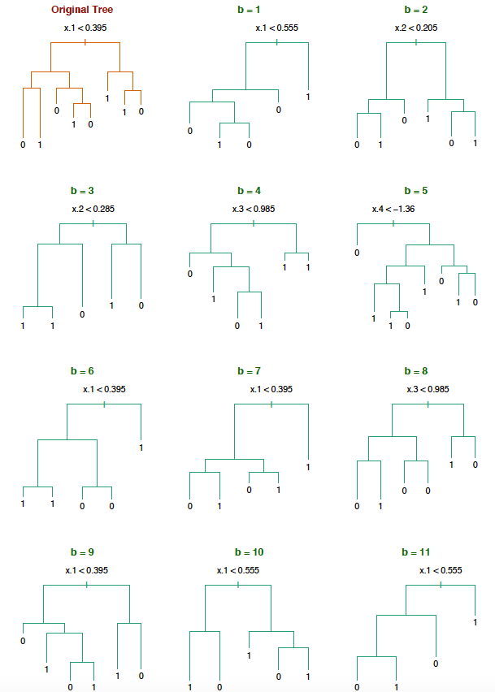

\newcommand{\Expect}[1]{E\left[ #1 \right]}
\newcommand{\Var}[1]{\mathbb{V}\left[ #1 \right]}
\newcommand{\Cov}[2]{\mathrm{Cov}\left[#1,\ #2\right]}

\newcommand{\E}{\mathbb{E}}
\renewcommand{\P}{\mathbb{P}}
\newcommand{\R}{\mathbb{R}}
\newcommand{\tr}[1]{\mbox{tr}(#1)}
\newcommand{\brt}{\widehat{\beta}_{r,t}}
\newcommand{\brl}{\widehat{\beta}_{r,\lambda}}
\newcommand{\bls}{\widehat{\beta}_{ls}}
\newcommand{\blt}{\widehat{\beta}_{l,t}}
\newcommand{\bll}{\widehat{\beta}_{l,\lambda}}

\newcommand{\argmin}[1]{\underset{#1}{\textrm{argmin}}}

\renewcommand{\vec}[1]{\underline{#1}}
\newcommand{\vX}{\vec{X}}
\newcommand{\X}{\vX}
\newcommand{\vx}{\vec{x}}
\newcommand{\vY}{\vec{Y}}
\newcommand{\vy}{\vec{y}}
\newcommand{\vmu}{\vec{\mu}}
\newcommand{\vSigma}{\vec{\Sigma}}
\newcommand{\vbeta}{\vec{\beta}}
\newcommand{\bhat}{\widehat{\beta}}
\newcommand{\vbhat}{\vec{\widehat{\beta}}}
\newcommand{\sumin}{\sum_{i=1}^n}
\newcommand{\sumjp}{\sum_{j=1}^p}

\newcommand\given{\:\vert\:}


```{r setup, echo=FALSE,results='hide',include=FALSE}
# Need the knitr package to set chunk options
library(knitr)
# Set knitr options for knitting code into the report:
# - Don't print out code (echo)
# - Save results so that code blocks aren't re-run unless code changes (cache),
# _or_ a relevant earlier code block changed (autodep), but don't re-run if the
# only thing that changed was the comments (cache.comments)
# - Don't clutter R output with messages or warnings (message, warning)
  # This _will_ leave error messages showing up in the knitted report
opts_chunk$set(message=FALSE, warning=FALSE, fig.align='center',fig.width=8,
               fig.height=4,cache=TRUE,autodep=TRUE, global.par=TRUE)
par(las=1, bty='n', pch=19, ann=FALSE)
library(tidyverse)
library(plyr)
library(gridExtra)
library(MASS)
library(caret)
library(e1071)
library(ggplot2)
library(ellipse)
#theme_set(theme_minimal(base_family="Times"))
green = '#00AF64'
blue = '#0B61A4'
red = '#FF4900'
orange = '#FF9200'

set.seed(111)
```

## Upcoming Course Schedule

__HW 5__: Due next Friday, April 12 by 11:59 PM.

__Exam__: On Friday, April 12, your final exam will be made available. You will have until Sunday, April 21 11:59 PM to finish your exam.

  * Exam will be made available via a personal repo. You will get a message on Slack with a link; click that link to create the repo via GitHub Classroom.
  
  * Let's hope GitHub classroom doesn't fail like last time -_-.
  
__Project__: There are two parts remaining for your project. You have presentations April 23 and/or 25. Project Checkpoint 3 Due Monday April 29 by 11:59 PM.


## Presenations

  * These will be delivered during the final week of classes, April 23 and/or 25. 
  
  * Each group should prepare a 15 minute (maximum) presentation emphasizing the data, question, methods, and conclusions of their project. You should prepare slides (this can be done easily in Rmarkdown) which shows appropriate graphical displays and aids the delivery. 
  
  * Aim it at a smart audience with statistical training to the level of multiple linear regression but not beyond. Any modeling techiques learned in this class should be summarized. For example, you should not just say “We did KNN” but also explain the basic idea of how it works, why it might be better than linear regression, etc.
  
  * Points (25 pts) will be allocated for clear articulations of the data you used, of the question(s) of interest, notable aspects of the data (most important aspects of EDA), the approach you used to answer your research question(s), the reason you chose that approach, and the conclusions you were able to draw.

  * How to allocate presentation days... All one day? Two on Tuesday and two on Thursday?

## Project Check Point 3

  * Due Monday April 29 by 11:59 PM.

Each group should submit one report. It must consist of the following
sections. (page numbers are relative as your report should render in html)

1. __Introduction__ (1-2 page) Write three to four paragraphs introducing the research
  problem and describing the specific research hypothesis. Cite any information
  sources in parentheses or foot- or end- notes.
2. __EDA__ (about 5 pages) This section should incorporate some
  material from the 
  Midterm report (with any changes suggested in my grading thereof) as
  well as any new analyses which seem desirable as you have made
  further progress. Only the most relevant analyses should be included
  by now. You _may_ put the rest in an Appendix (but you probably shouldn't). 
3. __Results and analysis__ (about 5 pages) Address 
  the specific question(s) of interest with methods of your choice (these can graphical, numerical, 
  or statistical models). 
  Be sure to justify the choices you make, and explain why your calculations lead to the 
  results that you discuss. Models without justification, figures presenting irrelevant material,
  or large tables of uninterpreted numbers will be treated harshly.
4. __Discussions/results__ (1-2 pages) What are your conclusions?  Identify a few key
  findings, and discuss, with reference to the supporting evidence.  Can you
  come up with explanations for the patterns you have found?  Suggestions or
  recommendations for future work?  How could your analysis be improved?  


Total page length: __10 to 15 pages__ + appendix as necessary. Be sure to describe your graphics carefully. Plots with no description are useless.
## PC 3 Rubric

```{r grade-vector-pc3, echo=FALSE}
a = c(8, 1, 7, 4, 15, 30, 10, 0)
tot = sum(a)
ab_print <- function(pos, modify){
  a <- a
  b <- a[pos]
  c <- b + modify
  a[pos] <- c
  a <<- a
  paste0(c,' / ', b)
}
```

__Words__ (`r ab_print(1, 0)`) The text is laid out cleanly, with clear divisions and
transitions between sections and sub-sections.  The writing itself is
well-organized, divided into complete sentences logically grouped into paragraphs and sections, and easy to follow from the presumed level of knowledge.

__Numbers__ (`r ab_print(2, 0)`) All numerical results or summaries are reported to
suitable precision, and with appropriate measures of uncertainty attached when
applicable.

__Pictures__ (`r ab_print(3, 0)`) Figures and tables are easy to read, with informative
captions, axis labels and legends, and are placed near the relevant pieces of
text.

__Code__ (`r ab_print(4, 0)`) The code is formatted and organized so that it is easy
for others to read and understand.  It is indented, commented, and uses
meaningful names.  It only includes computations which are actually needed to
answer the analytical questions, and avoids redundancy.  Code borrowed from the
notes, from books, or from resources found online is explicitly acknowledged
and sourced in the comments. The text of the report is free of intrusive blocks of code and useless output. If you use R Markdown, all calculations are actually done in the file as it knits,
and only relevant results are shown and explained. 

__Exploratory Data Analysis__ (`r ab_print(5, 0)`) Your job is to clearly explain the data in such a way so that the audience feels comfortable and has a reasonable understanding of the data. Variables are examined individually and
bivariately. Features/observations are discussed with appropriate
figure or tables. The relevance of the EDA to the questions and
potential models is clearly explained. 

__Results and analysis__ (`r ab_print(6, 0)`) The statistical summaries
are clearly related to, or possibly derive from, the substantive questions of interest.  Any
assumptions are checked by means of appropriate diagnostic plots or
formal tests. Limitations from un-fixable problems are
clearly noted. The actual estimation
of parameters, predictions, or other calculations are technically correct.  All calculations
based on estimates are clearly explained, and also technically correct. 

__Conclusions__ (`r ab_print(7, 0)`) The substantive questions are answered as
precisely as the data and the model allow. The chain of reasoning from
estimation results about models, or derived quantities, to substantive
conclusions is both clear and convincing. If uncertainties in the data mean the answers to some
questions must be imprecise, this too is reflected in the conclusions.


__Extra credit__ (`r ab_print(8, 0)`) Up to twenty points may be awarded for reports which
are unusually well-written, where the code is unusually elegant, where the
analytical methods are unusually insightful, or where the analysis goes beyond
the required set of analytical questions.


__Grade__: `r sum(a)` out of `r tot` possible

\newpage

## Problems With CART (Classification And Regression Trees) Models

Some intial advantages of trees relate to their simple construction and interpretability:

__Pros:__

+ Trees are very easy to explain (much easier than even linear regression).  

+ Some people believe that decision trees mirror human decision.  

+ Trees can easily be displayed graphically no matter the dimension of the data.

+ Trees can easily handle qualitative predictors without the need to create dummy variables.

When we create trees, often the observations will be grouped into relatively (compared to the total sample) small groups. This leads to a couple of problems:

__Cons:__

  * We may overfit to training observations. This leads to poor predictive accuracy (high test variability).
  
  * Small changes in the data can cause large changes in to over all tree.
  
Remember, we group like observations into regions (tree leaves) of the predictor space: $R_1, \dots, R_M$.

Our prediction is the mean of the response for the training observations within the $m$th box:

$$\widehat{y}_{R_m} = \frac{1}{n_{R_m}}\sum_{i:\vx \in R_m}y_i$$

What is the variance of this sample mean, versus the variance of a sample mean using the entire data?


## New Data Example: Predicting Pulsar Stars

```{r pulsarsload, fig.height = 8}
library(tree)
library(caret)
stars <- read.csv('data/stars.csv') # No NAs luckily enough.
stars$pulsar <- as.factor(stars$pulsar)

train.ind <- sample(1:nrow(stars), nrow(stars)/2)
test.ind <- (1:nrow(stars))[-train.ind]

tree <- tree(pulsar ~ ., data = stars, subset = train.ind)
tree.gini <- tree(pulsar ~., data = stars, subset = train.ind, split = "gini")

plot(tree, type = "uniform")
text(tree, cex=0.8)

plot(stars$ExKurtIntProf, stars$SdDMSNR, col = as.numeric(stars$pulsar)+1, 
     pch = 1, 
     xlab = "Excess Kurtosis of Interior Profile", ylab = "SD of DM-SNR")
partition.tree(tree, ordvars = c("ExKurtIntProf", "SdDMSNR"), col = "black", add = TRUE)
legend(6,20,legend=unique(stars$pulsar),
       col=unique(as.numeric(stars$pulsar)+1), pch = 1)


plot(tree.gini, type = "uniform") # Maybe Gini not so good...
text(tree.gini, cex=0.5)

test_data = stars[test.ind,]
test_data$class = predict(tree, test_data, type='class')
test_data$prob = predict(tree, test_data, type='vector')[,2]
test_data = mutate(test_data, correct = class==pulsar) # Make new "correct" variable

# Misclassification Rate
predclass = data.frame(truth = stars$pulsar[test.ind])
predclass$tree = predict(tree, newdata = stars[test.ind,], type='class') ## for later

```

## Bagging: Introduction

Many methods (trees included) tend to be designed to have lower bias but high variance.  

This means that if we split the training data into two parts at random and fit a regression or decision tree to each part, the results could be quite different.


In contrast, a low variance/high bias estimator would yield similar across many different training sets.


__Bagging__, also known as __bootstrap aggregation__, is a general purpose procedure for reducing variance. We'll use it specifically in the context of trees, but it can be applied much more broadly.


Suppose we have $n$ uncorrelated observations $Z_1, \ldots, Z_n$, each with variance $\sigma^2$.


What is the variance of
\[
\overline{Z} = \frac{1}{n} \sum_{i=1}^n Z_i?
\]


More generally, if we have $B$ separate (uncorrelated) training sets, $1, \ldots, B$, we can form $B$ separate model fits, 
$\widehat{f}^1(x), \ldots, \widehat{f}^B(x)$, and then average them:
\[
\widehat{f}_{B}(x) = \frac{1}{B} \sum_{b=1}^B \widehat{f}^b(x)
\]


## Bagging: The Bootstrap Part

Of course, this isn't practical as having access to many training sets is unlikely.  We therefore
turn to the bootstrap to simulate having many training sets.


Suppose we have data $Z_1, \ldots, Z_n$ and we want to get an idea of the sampling
distribution of some statistic $f(Z_1,\ldots,Z_n)$.  Then we do the following

1. Choose some large number of samples, $B$. 
2. For each $b = 1,\ldots,B$, draw a new dataset from $Z_1, \ldots, Z_n$, call it 
$Z_1^*, \ldots, Z_n^*$. Remember, in bootstrapping, we sample from the orginal dataset with replacement!
3. Compute $\widehat{f}_b^* = \widehat{f}(Z_1^*, \ldots, Z_n^*)$.


Now, instead of having $B$ separate training sets, we do $B$ bootstrap samples.
$\widehat{f}_1^{*}(x), \ldots, \widehat{f}_B^{*}(x)$, and then average them:
\[
\widehat{f}_{\textrm{bag}}(x) = \frac{1}{B} \sum_{b=1}^B \widehat{f}_b^{*}(x)
\]
This process is known as Bagging (bootstrap aggregation).


## Bagging trees

The procedure for trees is the following


1. Choose a large number $B$.
2. For each $b = 1,\ldots, B$, grow an unpruned tree on the $b^{th}$ bootstrap draw from the data.
3. Average the predictions of all these trees together.


Each tree, since it is unpruned, will have high variance and
low bias.

Therefore averaging many trees results in an estimator that has lower variance and still
low bias.


Caveat: Be careful bootstrapping time series data.



## Bagging the Pulsar Data

```{r pulsar.bag.visual, fig.height = 9}
par(mfrow = c(3,2))
B = 6
set.seed(1)
for(i in 1:B){
  
  boot <- stars[sample(1:nrow(stars), replace = T),]
  tree <- tree(pulsar ~ ., data = boot)
  plot(tree, type = "uniform")
  text(tree)
  
}
par(mfrow = c(1,1))

```

## Bagging trees: Variable Importance Measures


Though bagging can improve predictive performance of trees, the trade-off is we sacrificed some
interpretability. 

We no longer have that nice diagram that shows the segmentation of the predictor space (or, more accurately, we have $B$ of them).  


To recover some information, we can do the following:

1. For each of the $b$ trees and each of the $p$ variables, we record the amount that the Gini index is reduced by the addition of that variable 
2. Report the average reduction over all $B$ trees.


```{r}
library(randomForest)

bag = randomForest(pulsar ~ .,data=stars, subset=train.ind, mtry=ncol(stars)-1)

predclass$bag = predict(bag, test_data)

out = varImpPlot(bag)
```

Notice that `ExKurtIntProf` is EXTREMELY important compared to the rest of the predictors.

Should we mostly dismiss the other predictors? (I don't know... I'm not an Astrophysicist.)

## Out-of-Bag error estimation (OOB)

One can show that, on average, drawing $n$ samples from $n$ observations with replacement (also known as bootstrap) results in about 2/3 of the observations being selected.


The remaining one-third of the observations not used are referred to as __out-of-bag (OOB)__.


We can think of it as a for-free cross-validation.  


Each time a tree is grown, we can get its prediction error on the unused observations.  We average this over all bootstrap samples.

```{r, bag.test}
bag.test <-randomForest(pulsar ~ .,data=stars, subset=train.ind, mtry=ncol(stars)-1, 
                        xtest=stars[test.ind,-9], ytest = stars[test.ind,9])
```

```{r, OOB.Error.Stars}
bag.test

head(bag.test$err.rate)
df <- as.data.frame(bag.test$err.rate)
df$Trees <- 1:nrow(bag.test$err.rate)
df$Test <- bag.test$test$err.rate[,1]

gather(df, "Error Type", "Error", -Trees) %>%
  ggplot(aes(x = Trees, y = Error, color = `Error Type`)) + geom_line() +
  xlab("Number of Trees in Bag") +
  ylab("Misclassification Error")


```


## Random Forest: Decorrelated Bagging

Random Forest is a small extension of Bagging, in which the bootstrap trees are decorrelated (sort of...).  


The idea is, we draw a bootstrap sample and start to build a tree. 

* At each split, we randomly select
$m$ of the possible $p$ predictors as candidates for the split. 
* A new sample of size $m$ of the predictors is taken at each split. 
   


Usually, we use about $m = \sqrt{p}$ 

(this would be 2  predictors for `stars` data).


In other words, at each split, we aren't even allowed to consider the majority of possible predictors!

__Note:__ The following demonstration shows a pseudo-random forest. The same two randomly selected predictors are used for the whole tree instead of a random selection of predictors at each branch.
```{r RandForestStars, fig.height = 8}
par(mfrow = c(3,2))

for(i in 1:6){
  
  columns <- sample(1:(ncol(stars)-1), sqrt(ncol(stars)-1))
  predictors.char <- paste(names(stars)[columns], collapse = " + ")
  
  formula <- as.formula(paste0("pulsar ~", predictors.char))
  
  rtree <- tree(formula, data = stars)
  
  plot(rtree, type = "uniform")
  text(rtree, cex=0.8)
  
}


```


## Why Random Forests?: Problems With Bagging

What is going on here?


Suppose there is 1 really strong predictor and many mediocre ones. 


* Then each tree will have this one predictor in it,
* Therefore, each tree will look very similar (i.e. highly correlated).  
* Averaging highly correlated things leads to much less variance reduction than if they were uncorrelated.

If we don't allow some trees/splits to use this important variable, each of the trees will be much less similar and hence much less correlated.


Bagging Trees is Random Forest when $m = p$, that is, when we can consider all the variables at each split.

## Variable Importance in Random Forests

The form for getting variable importance is the same for random forests. We record the average of how well each variable improves the trees.

How does the variable importance differ in the random forest versus the tree bagging? Why would we see this?
```{r}
library(randomForest)

rf = randomForest(pulsar ~ ., data=stars, subset=train.ind)

predclass$rf = predict(rf, test_data)

out = varImpPlot(rf)
```

## OOB Error Estimation in Random Forests

The idea of OOB error estimation is the same in random forests.

  * Get a bootstrapped sample.
  * Build a tree.
  * Estimate test error using observations left out of bootstrapped sample.

```{r, rf.test}
rf.test <-randomForest(pulsar ~ .,data=stars, subset=train.ind, mtry=sqrt(ncol(stars)-1), 
                        xtest=stars[test.ind,-9], ytest = stars[test.ind,9])
```


```{r, RF.OOB}
rm(df)

rf.test

head(rf.test$err.rate)
df <- as.data.frame(rf.test$err.rate)
df$Trees <- 1:nrow(rf.test$err.rate)
df$Test <- rf.test$test$err.rate[,1]

gather(df, "Error Type", "Error", -Trees) %>%
  ggplot(aes(x = Trees, y = Error, color = `Error Type`)) + geom_line() +
  xlab("Number of Trees in Bag") +
  ylab("Misclassification Error")


```

## Comparing Bagging OOB Error to Random Forest

```{r Compare}
bag.test
rf.test

df <- data.frame(Bag_OOB_Error = bag.test$err.rate[,1], Bag_Test_Error = bag.test$test$err.rate[,1],
                 RF_OOB_Error = rf.test$err.rate[,1], RF_Test_Error = rf.test$test$err.rate[,1])
df$Trees <- 1:nrow(bag.test$err.rate)

gather(df, "Error Type", "Error", -Trees) %>%
  ggplot(aes(x = Trees, y = Error, color = `Error Type`)) + geom_line() +
  xlab("Number of Trees in Bag") +
  ylab("Error")
```

## Reporting results

There are two main ways classification results are reported:


* Sensitivity/specificity
* Confusion matrix


## Reporting results: Sensitivity/specificity


__Sensitivity:__  The proportion of times we label 'recession', given 
                 that 'recession' is the correct answer. 
                  (True $+$)  
__Specificity:__  The proportion of times we label 'no recession', given
                 that 'no recession' is the correct answer. 
                  (True $-$) 


We can think of this in terms of hypothesis testing.  If
\[
H_0: \textrm{ no recession},
\]
then 

__Sensitivity:__  $P(\textrm{reject } H_0 | H_0 \textrm{ is false})$, that is: 1 - $P$(Type II error)  
__Specificity:__  $P(\textrm{accept } H_0 | H_0 \textrm{ is true})$, that is: 1 - $P$(Type I error) 


## Tree results: Confusion matrices


```{r}
predclass$null = as.factor(rep(0,length(test.ind)))
```

### __NULL MODEL__: All stars are not pulsars.

```{r}
confusionMatrix(predclass$null, predclass$truth, positive = "1")
```


### __Tree Model__

```{r} 
confusionMatrix(predclass$tree, predclass$truth, positive = "1")
```


### __Bagging__

```{r}
confusionMatrix(predclass$bag, predclass$truth, positive = "1")
```

### __Random Forest__
```{r}
confusionMatrix(predclass$rf, predclass$truth, positive = "1")
```


## Classification Methods Overall

There are many, many different classification algorithms.


Different methods will work bettter in different situations.

__Linear:__          Logisitic regression,
 linear discriminant analysis (LDA),  
 GLMNET, separating hyperplanes 
 
__Non-linear:__  quadratic discriminant analysis (QDA),
 trees (and associated methods), 
 K-nearest neighbors (KNN),
 Support vector machines (SVM), 
 Neural networks 


