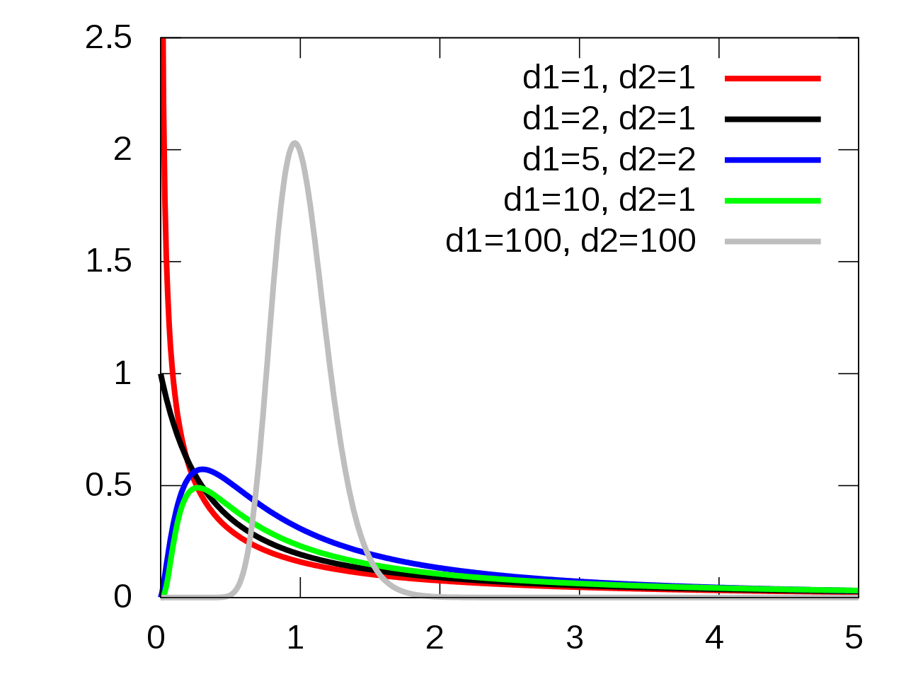

\newcommand{\Expect}[1]{E\left[ #1 \right]}
\newcommand{\Var}[1]{\mathbb{V}\left[ #1 \right]}
\newcommand{\Cov}[2]{\mathrm{Cov}\left[#1,\ #2\right]}

\newcommand{\E}{\mathbb{E}}
\renewcommand{\P}{\mathbb{P}}
\newcommand{\R}{\mathbb{R}}
\newcommand{\tr}[1]{\mbox{tr}(#1)}
\newcommand{\brt}{\widehat{\beta}_{r,t}}
\newcommand{\brl}{\widehat{\beta}_{r,\lambda}}
\newcommand{\bls}{\widehat{\beta}_{ls}}
\newcommand{\blt}{\widehat{\beta}_{l,t}}
\newcommand{\bll}{\widehat{\beta}_{l,\lambda}}

\newcommand{\argmin}[1]{\underset{#1}{\textrm{argmin}}}

\renewcommand{\vec}[1]{\underline{#1}}
\newcommand{\vX}{\vec{X}}
\newcommand{\X}{\vX}
\newcommand{\vx}{\vec{x}}
\newcommand{\vY}{\vec{Y}}
\newcommand{\vy}{\vec{y}}
\newcommand{\vmu}{\vec{\mu}}
\newcommand{\vSigma}{\vec{\Sigma}}
\newcommand{\vbeta}{\vec{\beta}}
\newcommand{\bhat}{\widehat{\beta}}
\newcommand{\vbhat}{\vec{\widehat{\beta}}}
\newcommand{\sumin}{\sum_{i=1}^n}
\newcommand{\sumjp}{\sum_{j=1}^p}

\newcommand\given{\:\vert\:}


```{r setup, echo=FALSE,results='hide',include=FALSE}
# Need the knitr package to set chunk options
library(knitr)
# Set knitr options for knitting code into the report:
# - Don't print out code (echo)
# - Save results so that code blocks aren't re-run unless code changes (cache),
# _or_ a relevant earlier code block changed (autodep), but don't re-run if the
# only thing that changed was the comments (cache.comments)
# - Don't clutter R output with messages or warnings (message, warning)
  # This _will_ leave error messages showing up in the knitted report
opts_chunk$set(message=FALSE, warning=FALSE, fig.align='center',fig.width=8,
               fig.height=4,cache=TRUE,autodep=TRUE, global.par=TRUE)
par(las=1, bty='n', pch=19, ann=FALSE)
library(tidyverse)
library(plyr)
library(gridExtra)
library(MASS)
library(caret)
library(e1071)
library(ggplot2)
library(ellipse)
#theme_set(theme_minimal(base_family="Times"))
green = '#00AF64'
blue = '#0B61A4'
red = '#FF4900'
orange = '#FF9200'

```

## Experimental Design

ANOVA research methods are not different in terms of objectives of previous discussed methods

__Response Variable__: The variable of interest that we want to predict.

__Predictors/Independent Variables__: Variables we hope are influential in predicting the response variable.

What differs in the ANOVA setting is that we are typically investigating the results of highly controlled experiments.

  * A controlled experimental setting is used so that we can make assertions about causality of the effects of the predictor variables on the response variable.
  

## Experimental Design Terminology
The setup for terminiology

  * __Response Variable__: A variable of interest in a study.
  * __Factors__: Variables that may influence the outcome of the response variable.
    + __Factor Levels__: The possible values a factor will take in an experiment.
    
  * __Experimental Study__: Control the levels of factors to procedurally control the possible outcomes of a response variable.
  
  * __Treatments__: The combinations of the different levels of factors. If only on factor is being examined in a study, the levels of that factor are the treatments.
  
  * __Experimental Units__: The indiviudals to which  treatment is applied.
  
In an experimental study, the environment of the experimental units is being controlled so that the only true difference between the experimental units is the treaaments.

  * __Completely Randomized Design__: A type of experimental study where a random sample of experimental units are randomly assigned to treatments.
  


  
## Example Experiment (This stuff is really dry...)

__Example__: The shelf life of stored meats is the time a prepackaged cut remains salable, safe, and nutritious. Standard packaging in ambient air atmosphere has a shelf life of about 48 hours after which the meat quality begins to deteriorate from microbial contamination, color degradation, and shrinkage. Vacuum packaging is effecting in suppressing microbial growth; however, other quality losses remain a problem.

Studies suggested controlled gas atmospheres as possible alternatives to existing packagings. Two atmospheres which promise to combine capability for suppressing microbial development while maintaining other meat qualities were (1) carbon dioxide (CO2), and (2) mixtures of carbon monoxide (CO), oxygen (O2), and nitrogen (N).

_Research Hypothesis_: Based on this new information an investigator hypothesized that some form of controlled gas atmosphere would provide a more effective packaging environment for meat storage.

_Treatment Design_: The treatment design developed by the investigator to address the hypothesis included packagings with (1) ambient air in a commercial wrap, (2) vacuum, (3) mixture of gases consisting of 1%CO, 40% O2, and 59% N, and (4) 100% CO2.

_Observed Variable_: Psychrotropic bacteria [log (count/$cm^2$)], on meat samples stored in four packaging conditions for nine days.

The first question we must answer: “Is there a detectable difference between the packaging types?”

```{r}
packaging <- read.csv("data/Packaging.csv")
# Sometimes read.csv doesn't read column headings correctly.
names(packaging) <- c("packaging", "logcount")

packaging$packaging <- as.factor(packaging$packaging)

ggplot(packaging, aes(x = packaging, y = logcount, color = packaging)) + geom_point()
```

Okay, Great! The groups look different! But a problem is you have to validate that.

## General Objective of Analysis of Variance (ANOVA)

Hypotheses:


$\begin{aligned}
H_0&: \mu_1 = \mu_2 = \dots = \mu_t\\
H_1&: \text{not that...}
\end{aligned}$

Why not just do a bunch of separate t-tests?


```{r echo = F}

alpha = 0.01

Groups = 2:10
Risk = 1-(1-.01)^choose(Groups,2)

knitr::kable(data.frame(Groups, Risk), digits = 3, align = 'c',
             caption = "Chance of Type I Error when comparing many groups via pairwise comparisons")

```

## Formulating ANOVA

In ANOVA, we assess the varaibility within the groups and compare to the variability between the groups.

Notation:

  * $y_{ij}$ is the $j^{th}$ observation in the $i^{th}$ treatment group.
  
    + $i = 1, \dots, t$, where $t$ is the total number of treatment groups.
    + $j = 1, \dots, n_i$ where $n_i$ is the number of observations in treatment group $i$.
    

  * $\overline{y}_{i.} = \sum_{j=1}^{n_i}\frac{y_ij}{n_i}$ is the mean of treatment group $i$.
  * $\bar{y}_{..} = \sum_{i=1}^{t} \sum_{j=1}^{n_i}\frac{y_{ij}}{N}$ is the over all mean of all observations.
  
    + $N$ is the total number of observations.
    
Sum of Squares for the treatments

$\begin{aligned}
SST &= \sum_{i=1}^{t} n_i \left(\overline{y}_{i.} - \bar{y}_{..}\right)^2
\end{aligned}$

Sum of squares for the errors

$\begin{aligned}
SSE &= \sum_{i=1}^{t} \sum_{j=1}^{n_i}\left(\overline{y}_{ij} - \bar{y}_{i.}\right)^2
\end{aligned}$

With each sum of squares, there is an associated degrees of freedom.

 * Treatment: $df_t = t-1$
 * Error: $df_e = N - t$
 
 Which we use to create the Mean Squares
 
$\begin{aligned}
MST &= \frac{SST}{t-1}
\end{aligned}$

$\begin{aligned}
MSE &= \frac{SSE}{N-t}
\end{aligned}$

We say that under the null hypothesis, all groups have equivalent population means, the test statistic

$\begin{aligned}
F_t = \frac{MST}{MSE}
\end{aligned}$

follows the F-distribution.



## ANOVA For The Packaging Data

$H_0: \mu_{co2} = \mu_{mix} = \mu_{vac} = \mu_{wrap}$

$H_1: \text{Not } H_0$

```{r}

aov.fit <- aov(logcount ~ packaging, data = packaging)
lm.fit <- lm(logcount ~ packaging, data = packaging)

summary(aov.fit)
anova(lm.fit)

```

Okay, so we reject the null hypothesis and conclude that there is a "significant" difference in the mean log of bacterial count between the different packaging types.

But which difference? Almost always, we are not concerned with the so called "Global" F-test. It is merely the first step into investigation of the data.

## Linear Models  for ANOVA Experiments

ANOVA is just a subcategory of linear models.

The general form for many statistical models is:

$\begin{aligned}
y &= g(x) + \epsilon
\end{aligned}$

In linear regression we assume a form for the model

$\begin{aligned}
y &= \beta_0 + \beta_1 x_1 + \dots + \beta_p x_p + \epsilon
\end{aligned}$

We can look at ANOVA as a form of regression. First, let's start off with the simplest model:

$\begin{aligned}
y &= \mu + \epsilon
\end{aligned}$

Our deterministic portion of the model is just an overall mean.

In ANOVA, we are trying to assess whether different groups have different means. We have two ways of of modeling this:

__Means Model:__

$\begin{aligned}
y &= \mu_i + \epsilon
\end{aligned}$

Which leads to the hypotheses in ANOVA:

$H_0: \mu_{1} = \dots = \mu_{t}$

$H_1: \text{Not } H_0$

__Effects Model:__

$\begin{aligned}
y &= \mu + \tau_i + \epsilon
\end{aligned}$

Which leads to an equivalent set of hypotheses:

$H_0: \tau_{1} = \dots = \tau_{t}$

$H_1: \text{Not } H_0$

## Preplanned Comparisons VS Post Hoc Comparisons

If we reject $H_0$ in an ANOVA, we make the following conclusion: Of the means $\mu_1,\mu_2, \dots,\mu_t$, there is at least one mean that is different.

If we want to make a more detailed conclusion, we need to make comparisons between the individual groups. For example, we can test for the following cases:

$H_0: \mu_1 = \mu_2$

or

$H_0: \mu_2 = \frac{\mu_1 + \mu_3}{2}$


Comparisons fall under two categories: preplanned comparisons and post hoc comparisons.

__Preplanned Comparisons__: comparisons of the different group means, which are formulated before the experiment is conducted and research results are obtained.

__Post Hoc Comparisons__: are comparisons formulated after data have been collected and results are obtained.


If we are doing multiple hypothesis tests, we are increasing the chance that at least one of those tests will result in a false positive.

There are two types of Type I Error rates we are concerned with:

  * $\alpha_c$ or __Comparisonwise Error Rate__, the type I error rate done for an individual comparison/test.
  
  * $\alpha_e$ or __Experiementwise Error Rate__ or __Family Wise Error Rate__, the probability of making at least one Type I Error among $k$ comparisons.

$\begin{aligned}
FWER = \alpha_e = 1 - (1-\alpha_c)^k
\end{aligned}$


We wish to keep $\alpha_e$, the __experimentwise error rate__ the same value as that of the overall ANOVA test that was performed. To do this we have to create pairwise comparisons with a different value for $\alpha_c$, the comparisonwise error rate. 

## Formulating Research Questions

We had four groups in the packaging experiment:

A control:

  * ambient air in a commercial warp
  
Artificial Atmospheres:

  * Vacuum
  * Gas mixture: 1%CO, 40% O2, and 59% N
  * 100% CO2

Say we had the following research questions about the packaging experiment:

  1. How does an artifial atmosphere compare to plastic wrap?
  2. How does a vacuum compare to artificial gas packagings?
  3. Is CO2 more effective than the gas mixture.
  
These are _hopefully_ preplanned research questions. That is, we plan on investigating these questions _before_ we even get the data and see the following:

```{r}
ggplot(packaging, aes(x = packaging, y = logcount, color = packaging)) + geom_point()
```

To get an answer to these types of questions, we can look at __contrasts__.

## Contrasts

Contrasts are useful for preplanned comparisons. A contrast is a linear function of the $\mu_i$'s where the sum of the coefficients sum to zero.

$\begin{aligned}
 C &= \sum_{i=1}^t a_i \mu_i
\end{aligned}$

$\begin{aligned}
\sum_{i=1}^t a_i &= 0
\end{aligned}$

We test the fololowing hypotheses using contrasts:

$\begin{aligned}
H_0:& C = 0 \quad \iff \quad \sum_{i=1}^t a_i \mu_i = 0\\
\\
H_1:& C \neq 0 \quad \iff \quad \sum_{i=1}^t a_i \mu_i = 0
\end{aligned}$

We estimate the contrast you the sample means of the groups:

$\begin{aligned}
 \widehat{C} &= \sum_{i=1}^t a_i \bar{y}_{i.}
\end{aligned}$

The standard error of this statistic is computed using:

$\begin{aligned}
 s^2_C = MSE\cdot \left(\sum_{i=1}^t\frac{a_i^2}{n_i}\right)
\end{aligned}$

This allows us to form test statistics which are functionally equivalent to each other:

$t_C = \frac{\sum_{i=1}^t a_i \bar{y}_{i.}}{\sqrt{MSE\cdot \left(\sum_{i=1}^t\frac{a_i^2}{n_i}\right)}} \quad \to \quad t(df_e)$

Or

$F_C = \frac{\left(\sum_{i=1}^t a_i \bar{y}_{i.}\right)^2}{MSE\cdot \left(\sum_{i=1}^t\frac{a_i^2}{n_i}\right)} \quad \to \quad F(1,df_e)$

## Packaging Contrasts

In `R` we will have to be careful about the order of the levels to determine the order of the coefficients in the contrast.

```{r}
levels(packaging$packaging)
```

So the general form of the contrasts is

$$ C = a_1\mu_{C02} + a_2 \mu_{mix} + a_3 \mu_{vac} + a_4 \mu_{wrap} $$


\begin{tabular}{l| c c c c}
Contrast & $a_1$ & $a_2$ & $a_3$ & $a_4$ \\ [0.5ex] \hline \hline
Artificial vs. Wrap & $1$ & $1$ & $1$ & $-3$ \\ [0.5ex]
  & $1/3$ & $1/3$ & $1/3$ & $-1$ \\ [0.5ex] \hline
Vac.  vs. Artifical Gas & $1$ & $1$ & $-2$ & $0$\\ [0.5ex] \hline
CO2 vs Mixed & $1$ & $-1$ & 0 & 0\\ [0.5ex] \hline
\end{tabular}

In `R` this is a bit tedious but the most sensical way I have seen to do this is using the `lsmeans` packages.

```{r}
library(lsmeans)

lm.fit <- lm(logcount ~ packaging, data = packaging)

# Need an lsmeans object where the treatments factor is specified
leastsquare = lsmeans(lm.fit, "packaging")

# Define contrasts in a list
Contrasts = list(ArtVSWrap = c(1,  1, 1, -3),
                 VacVSGas = c(1, 1,  -2, 0),
                 CO2VsMixed = c(1, -1, 0, 0))

# Get contrasts
contrast(leastsquare, Contrasts, adjust="none")
```

But what is that `adjust` option?

## Multiple Comparisons: Family Wise Error Rate

When performing multiple hypothesis tests, we already discussed what happens to the probability of making at least 1 Type I error if the null hypothesis is true for $m$ hypothesis tests.

$\begin{aligned}
\alpha_e = 1 - (1-\alpha_c)^m
\end{aligned}$

We want the family wise error rate to be controlled to be controlled.

To do these there are a few methods:

Controlling $a_c$ to control FWER:

  * Sidak method
  * Bonferroni Method
  
Adjust the distribution of the test statistic.

  * Tukey HSD (Honestly Significant Difference) Procedure (Pairwise Comparisons Only)
  
## Sidak and Bonferroni Method

The Sidak and Bonferroni method are a couple of the most basic procedures for managing the FWER.

 * We want FWER $\leq \alpha$
 
__Bonferroni Correction__

If we are doing $m$ hypothesis tests, each with their own p-value $p_i$, $i = 1,\dots, m$, the Bonferroni method is based off a famour inequality in mathematical statistics.

It is summarized under the following rule for reject the Null Hypothesis for each of several related hypothesis tests.

  * Reject $H_0$ when $p_i \leq \frac{\alpha}{m}$
  * Reject $H_0$ when $p^*_i = m\cdot p_i \leq \alpha$
  
This is the _most conservative_ multiple comparison adjustment. It will fail to reject the null hypothesis too often.

__Sidak Correction__

The Sidak correction relies on the the computation of the FWER or $\alpha_e$ when each comparison is done at a level $\alpha_c$

$\begin{aligned}
\alpha_e &= 1 - (1-\alpha_c)^m \\
\iff (1-\alpha_c)^m &=  1-\alpha_e \\ 
\iff  \alpha_c &=  1 - (1-\alpha_e)^{1/m}
\end{aligned}$

* Reject $H_0$ when $p_i \leq 1 - (1-\alpha)^{1/m}$. When all of the hypothesis tests are independent, this makes the FWER exactly $\alpha$.
* p-values are adjusted based off reversing the inequality, like with the bonferroni.

```{r}
contrast(leastsquare, Contrasts, adjust="none")

contrast(leastsquare, Contrasts, adjust="bonferroni")

contrast(leastsquare, Contrasts, adjust="sidak")
```

## Tukey HSD Procedure, Pairwise comparisons, Post Hoc

When we reject the null hypothesis in the global F-test for the Analysis of Variance, we are being told that there is one pair of means that really differ.

Not really a useful statement...

We may decide that we want to know exactly which means differ. Then the number of comparisons is

$\begin{aligned}
\binom{t}{2} = \frac{n(n-1)}{2}
\end{aligned}$

Tukey in 1949 created a way for exactly controlling the FWER in the when considering all pairwise comparisons.

This is based on a modified version of the t-test statistic:

$\begin{aligned}
q = \frac{\bar{y}_{max} - \bar{y}_{min}}{\hat{sigma}\sqrt{2/n}}
\end{aligned}$

The distribution formed from this test statistic is the _Studentized Range_ distribution: $q(t, df)$

```{r}
pairs(leastsquare)
```


## Moving to a World Beyond "p<0.05"

This year an editorial was published in _The American Statistician_.

[Ronald L. Wasserstein, Allen L. Schirm & Nicold A. Lazar (2019) _Moving to a World Beyond "p < 0.05", The American Statistician, 73:sup1, 1-19, DOI: 10.1080/00031305.2019.1583913](https://www.tandfonline.com/doi/full/10.1080/00031305.2019.1583913)


We have talked a lot about p-values today, but there has been more and more emphasis on how p-values should not be the end-all-be-all of research,


What's going on here?

## Don't Is Not Enough

For decades, there has been statements of caution about p-values from statisticians.

  * There are often misinterpreted
    + It's the "probability of observing a test statistic at least as extreme as what was observed given the null hypothesis is true" (Who can blame them for misunderstanding that)
    + Many think of it as "the probability that the data were created by chance". __Wrong!__
    
  * They are abused often
    + Scientists use p-values as the only justification for publishing results
    + "insignificant results" are not reported even though a "insignificant result" is just as important as a "significant result"
    + If a result is  not "significant" it may not be published.

Wasserstein et al. Start off with the following "Don'ts".

  * Don't base your conclusions soley on whether an association or effect was found to be "statistically significant" (i.e., the $p$-value passed some arbitrary threshhold such as $p < 0.05$, see previous section).
  
  * Don't believe that an association or effect exists just because it was statistically significant.
  
  * Don't believe that an association or effect is absent just because it was _not_ statistically significant.
    
  * Don't believe your $p$-value gives the probability that chance alone produced the observed association or effect, or the probability that the null hypothesis is true.
  
  * Don't conclude anything about scientific or practical importance based on statistical significance or lack thereof.
  
## Practical Importance versus Statistical Significance

An exagerated scenario. Large sample size $->$ nearly guaranteed _statistical_ significance. But is it practical?
```{r}
set.seed(999)
x1 <- rnorm(10000, mean = 100, sd = 15)
x2 <- rnorm(10000, mean = 101, sd = 15)

t.test(x1, x2)
```

## What Should We _Do_

There is not _one_ "solution that majesitically replaces the outsized role that statistical significance has come to play" (Wassersteing et al.)

The reccomendations are summarized as the following:

  * __A__ ccept uncertainty.
  * Be __T__ houghful.
  * Be __O__ pen.
  * Be __M__ odest.
  
__ATOM__...

Fine, whatever, call it ATOM. I'm sure scientists will get a real kick out of that. A reverse acronym... probably.
  
## Accept Uncertainty

  * Uncertainty is a universal phenomenon.
  
    + "statistical significance" may imply further scrutiny of what's going on
    
  * We use "significance" to dichotomize the world of reasearch into "effect" and "no effect".
      + The world is not a "yes" or "no" world.
    + Effects may be variable under different conditions. (Maybe jelly beans cause acne if you smash them up and smear them on your face...)
    
  * __Always__ attach a standard error estimate to any numerical values reported.
  
  * Avoid using Confidence Intervals (or similar variations) as another way to dichotomize the world.
    + Think of confidence intervals as "compataibility intervals". We want to display _potential_ effect sizes.
  
  * Accepting uncertainty may lead to:
    + creating better measures
    + more sensitive experimental designs
    + larger samples (ideally... but budget constraints will always exist)
    
  * Use meta-analyses to combine the the data and results of many researchers investigating the same questions.

## Be Thoughtful

Three questions researchers should consider.

  * What are the practical implications of the estimate?
  
  * How precise is the estimate?
  
  * Is the model correctly specified/is it close enough for comfort?
    + Are the modeling assumptions understood?
    + Are the assumptions valid?
    + Do the key results hold up when other modeling choices are made
    + Modeling assumptions should be sufficiently documented so independent researchers can critique, _and replicate_, the work.
    
__Thoughful Research__
  * considers scientific context and prior evidence.
  
  * looks ahead to prospective outcomes in the context of theory and previous research.
  
    + What do we know and how certain are we in what we know?
    + What magnitudes and differences, odds ratios, or other effect sizes are __practically__ important?
  
  * includes careful consideration of the definition of a __meaningful__ effect size.
  
  * considers related prior evidence, plausibility of mechanism, study design and data quality
  
  * considers all applicable statistical tools available and keeps up to date with development of novel techniques.
  
  * considers multiple approaches for solving problems.
    + Several different methods as alternatives or modifications of p-values are referenced in the article.
    
## Be Open

  * Completeness in reporting all analyses performed, and __all__ findings obtained regardless of "significance" of the results.
  
  * Understanding and accepting the role of expert judgement.
    + Judgement is subjective but should be made as carefully, as objectively, and as scientifically rigorous as possible.
    
  * Be open in reporting findings! Report p-values as _continuous descriptive statistics_
    + Often researches report only based off chosen arbitrary criterion for "significant" results, e.g., "results were significant (p < 0.05)". (Do not dichotomize!)
    + A $p$-value does not measure the size of an effect or the importance of the result.
    
  * Failing to be open leads to bias in publications of results.
  
  * One study is rarely enough.
  
  * Provide sufficient information so that other researchers can execute meaningful alternative analyses.
  
  
## Be Modest

  * Understand the limitations of your analyses, often researchers and the public confound statistics with reality.
    + Are eggs good or bad!?
    + What about booze?!
    
  * There is no __true__ statistical model underlying every problem (or any problem, perhaps).
    + Consider many possible models. (__Thoughtful__)
    
  * __Encourage__ others to replicate your study.
  
  * If replicated work is contrary to your own results, it is not a crisis. This is natural in the evolution of science.
  
  * Try to be a _neutral_ judge of the data rather than an advocate for your research hypotheses.
